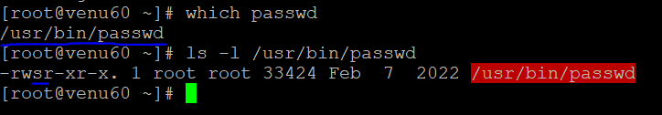
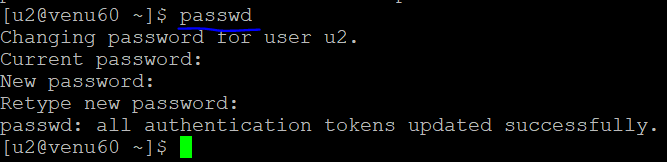
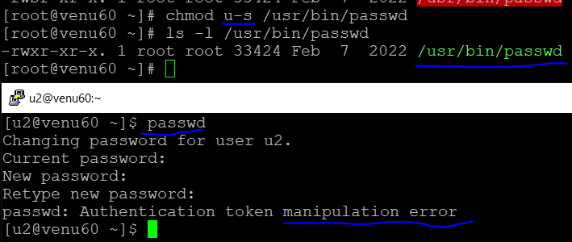
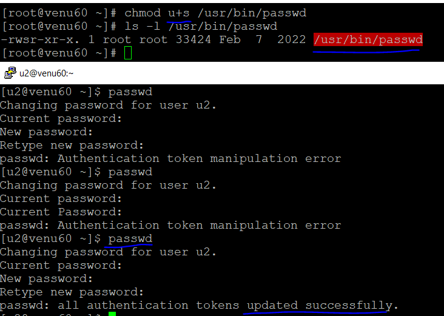
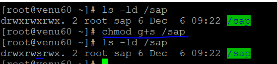
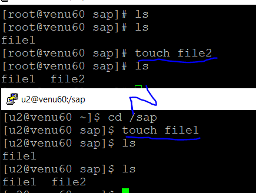
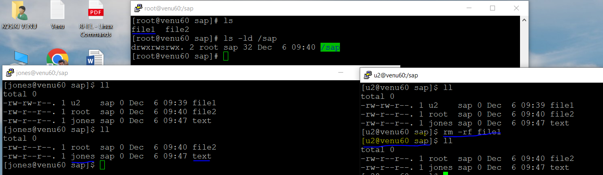
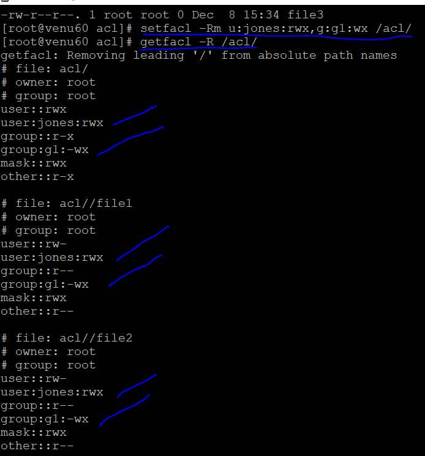

### FILE PERMISSIONS
##### USER (U+S)
* role of passwd command
  ```
  to assigning password for the user
  ```

* three types permission of a file/directory

  .User
  .Group
  .Others

  ```
  user:setuid -->u+s
  group:getgid -->g+s
  other -->o+t
  ``` 
* root can change the password for user
* normal user can change the password without applying u-s id
* normal user connot cannot change change the password with applying u+s id 

* check the location of the command

 ```
which ls
which cp
which passwd 
    
 ```
* apply u-s id (greeen r=for removing)
  ```
  ls -l /usr/bin/passwd
  chmod u-s /usr/bin/passwd
  ``` 
 

  

* apply u+s id (orange for applying)
  ```
  chmod u+s /usr/bin/passwd
  ``` 
   
  
#### GROUP (G+S)
  ```
  g+s
  g-s
  ```
* create a group name called `sap`
* create a director name called `sap`
  ```
  groupadd sap
  mkdir /sap
  ```
* convert the group into directory
  ```
  chgrp sap /sap
  chmod 777 /sap
  ls -ld /sap
  ```  
  

* applying `g+s` id for the directory
    
* owner creates a file and normal user enter into direcctory see the data 
  

* multiples user's enter into /sap directory both each other creates a file one user is read/delete for other user file same as another user.if their is no security for the directory

 

#### STICKY BIT (O+T) 

* one to one multiple user's read's/deleting the file ina directory 

*  applying sticky bit for the directory 

  ```
     chmod o+t /sap
    [root@venu60 ~]# ls -ld /sap
    drwxrwsrwt. 2 root sap 31 Dec  6 09:48 /sap
  ```
* when we applying `sticky bit (o+t)` for the directory 
cannot delete the files one to one user
  

  ```
  Note:
  files                        directory
  --------------------------------------
                   suid
                   sgid
                   o+t(sticky-bit)  
                   
  .suid: only works with files not directories
  .sgid: both works with files and directories
  .sticky-bit: not works with files and works with directories
  ```
* sticky-bit only protects the data into the directory   
