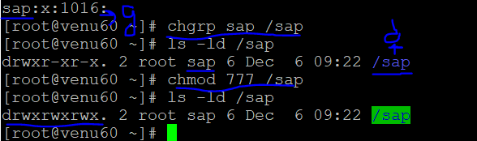
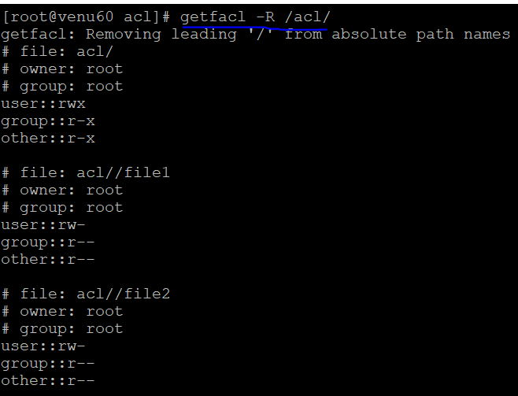

### ACCESS CONTROL LIST

#### USER (u+s,u-s):
* role of passwd command

  assigning password for the user

* User
* Group
* Others

* user: setuid=>u+s
* group: setgid=>g+s
* other: o+t=>stiky bit

* root user can be change the password for normal user
* normal user can be change the password without applying `u-s` id
* normal user connot be change the password with applying `u+s`id 

* check the location of the command

* which ls
* which cp
* which passwd 
    
* apply u-s id (greeen r=for removing)
  
  ```
  ls -l /usr/bin/passwd
  chmod u-s /usr/bin/passwd
  ``` 
 

  

* apply u+s id (orange for applying)
  ```
  chmod u+s /usr/bin/passwd
  ``` 
   
  
#### GROUP (g+s,g-s):

* g+s
* g-s
  
* create a group name called `sap`
* create a director name called `sap`
  
* groupadd sap
* mkdir /sap
  
* change the group into directory
  
* chgrp sap /sap
* chmod 777 /sap
* ls -ld /sap
   
  

* applying `g+s` id for the directory
    
* owner creates a file and normal user enter into direcctory see the data 
  

* multiples user's enter and edit the /sap directory folder both each other creates a file one user is read/delete for other user file same as another user.if their is no security for the directory

 

#### STICKY BIT (o+t,o-t): 

* one to one multiple user's read's/deleting the file ina directory 

*  applying sticky bit for the directory 

* chmod o+t /sap
* ls -ld /sap
  
  ```
   drwxrwsrwt. 2 root sap 31 Dec  6 09:48 /sap
  ```
* when we applying `sticky bit (o+t)` for the directory 
cannot delete the files one to one user

  ```
  Note:

  files                        directory
  --------------------------------------
                   suid
                   sgid
                   o+t(sticky-bit)  
                   
  .suid: only works with files not directories
  .sgid: both works with files and directories
  .sticky-bit: not works with files and works with directories
  ```
* sticky-bit only protects the data into the directory not files


#### ACL'S (Access Control List)
* setfacl --help
* setfacl <file_name>
* getfacl <file_name>
* m=>modify
* x=>remove the user,group and others
* Rm=>recurcively apply acl's files in the directory
* b=>remove the acl's from files
* Rb=>totally acl's from files in the diectory
  
* applying acl's for directory and in the files 

* for files:
  touch `file1` 
* getfacl file1
* setfacl -m u:u1:wx,u:u2:rx g:g1:wr, g:g2:r `file1`  
* getfacl `file1`

* for directory:
  mkdir app
* getfacl app  
* setfacl -Rm u:u1:wx,u:u2:rx g:g1:wr, g:g2:r `app`

* in the directory multiple files:
* setfacl -Rm u:u1:wx,u:u2:rx g:g1:wr, g:g2:r `app/file1{1..3}`
* getfacl `app/file{1..3}`
  
  

* remove the acl's from file
* setfacl -x u:u1:wx,u:u2:rx g:g1:wr, g:g2:r `file1` 
* getfacl `file1`

* totally remove the acl's from `file1` default
* setfacl -b `file1`
* getfacl `file1`

 

* remove the acl's from files in the diectory
* setfacl -Rb `app/file1{1..3}`


   


  