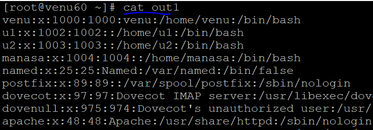
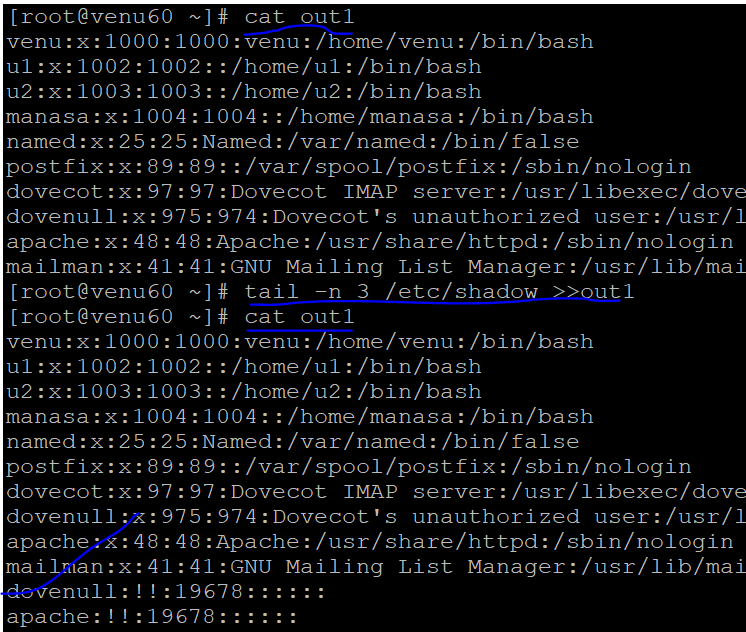
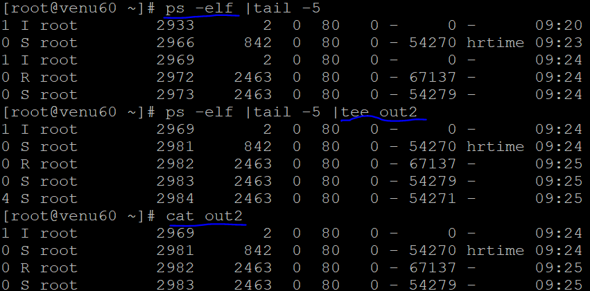
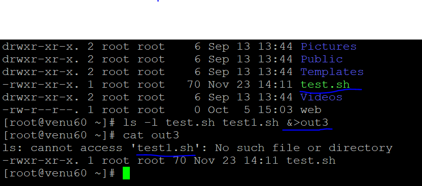
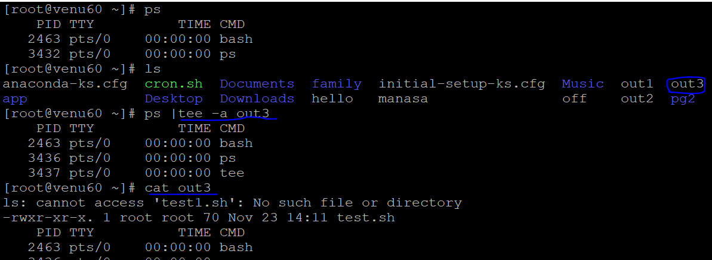

### I/O REDIRECTION

* capaturing the intput file to into new file
 
* tail /etc/passwd >out1
  

  

* capature another file preview o/p is not remove and new o/p is generated in same file

* tail /etc/shadow >>out1
  

* see the i/p & capature by using `tee` command
 

* `ls -l` have one file and in that no file
*  ls -l test.sh test1.sh `&>out3`
  
 
* capature the existing file with new i/p
 

* ls -l test app 2>&1 `file_name` for testing purpose
* app is existing file
* test is not existing file

* ls -l test app |tee `file_name` capature the both inputs into a file and show 

### FILE-PERMISSIONS:

* default size of file=>4KB

* default size of directory=>4.096KB

* file have three permissions 
* user
* group
* other
  
#### symbolic-method: rwx   
* applying permissions for files/directories* applying permissions for files/directories
  
* READ=>r
* WRITE=>w
* EXECUTE=>x
   
* creates a file names called as `test`

* touch test =>-rw-r--r--.
    
* apply permissions for `test` 

* chmod u=rwx,g=rx,o=rw `test`

* ls -l test    
* -rwxr-xrw-. 1 root root 0 Oct 18 15:06 test
  
#### numeric-method: 4 2 1 

* READ-->4-r
* WRITE-->2-w
* EXECUTE-->1-x
  
* change the permission file/directories `chmod` 

* chmod u=4+2+1=7,g=2+1=3,o=4+1=5 test1

* u=rwx,g=rx,o=rx test1
   
* create a file automatic to generate a default permission
  
  ```
  .-rw-r--r--. test
  ```  
* by using umask `022` value to calculate how to get default  permission generate for the `file` 

  ```
  FILE:

   -rw-r--r--
       777
   (-) 111
   ---------
        666     
   (-)  022 =>mask-value
      ------
        644 
   ----------
               READ=>   r-->4
               WRITE=>  w-->2
               EXECUTE=> x-->1 
    ```
* using umask `022` value to calculate how to get default  permission generate for `directory`

  ```
  DIRECTORY:

  drwxr-xr-x.
      777
   (-)022 =>umask-value
   --------
      755
   ---------   
               READ=>  r-->4
               WRITE=> w-->2
               EXECUTE=> x-->1

  --------- 
  
  ```
* in a directory have a multiple files
 
 example:
  
* mkdir app
* touch file{1..4}
  
* check the app in the files
  `ls -lZ app`
* give same permission for multiple files
  
* chmod -R 777 app
   
* get default permission for directory/file by based on umask value `022`
  
* dir=>755
* file=>644
    


   


     