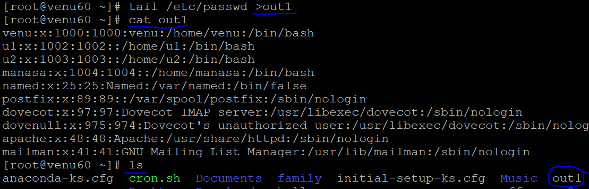

## I/O REDIRECTION

* capaturing the intput file to into new file
 
* tail /etc/passwd >out1
   
  

* capature another file preview o/p is not remove and new o/p is generated in same file

* tail /etc/shadow >>out1
  

* see the i/p & capature by using `tee` command
 

* `ls -l` have one file and in that no file
*  ls -l test.sh test1.sh `&>out3`
  
 
* capature the existing file with new i/p
  

## FILE PERMISSION

* default size of file

  ```
  4 KB
  ```
* default size of directory

  ```
  4.096
  ```
* ls -l
   ```
  .user
  .group
  .other
  ```
* applying permissions for files/directories
* user want create a file/directory
   .ls -l

#### symbolic method   

*  ```
   READ-->r
   WRITE-->w
   EXECUTE-->x
   ```
* suppose user creates a file names called as `test`

  ```
  test
  -rw-r--r--.
  ```   
* apply permissions for `test` files

   ```
   user-->rwx
   group-->rx
   others-->rw
   
  chmod u=rwx,g=rx,o=rw `test`

    ls -l hello
   -rwxr-xrw-. 1 root root 0 Oct 18 15:06 test
  ```


#### numeric method 

  ```
   READ-->4
   WRITE-->2
   EXECUTE-->1
  ```

* to change the permission file/directories `chmod` 

   ```
   chmod u=4+2+1=7,g=2+1=3,o=4+1=5 test1
        u=rwx,g=rx,o=rx test1
   ```

* how to create a default permission for file


* while create a file automatic to generate a default permission
  ```
  .-rw-r--r--. test
  ```  
* by using umask `022` value to calculate how to get default create permission  for `file` 

  ```
   -rw-r--r--
       777
   (-) 111
   ---------
        666     
   (-)  022
      ------
        644 
   ----------
               READ-->r-->4
               WRITE-->w-->2
               EXECUTE-->x-->1 
    ```
* by using umask `022` value to calculate how to get default create permission  for `directory`

  ```
  drwxr-xr-x.
      777
   (-)022
   --------
      755
   ----------   
               READ-->r-->4
               WRITE-->w-->2
               EXECUTE-->x-->1

  --------- 
  ```


   


     