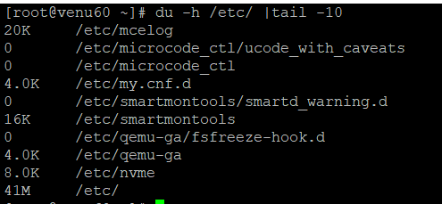
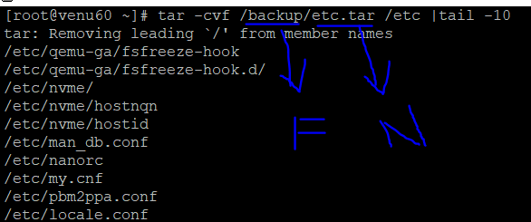
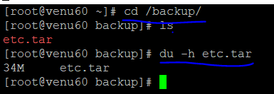
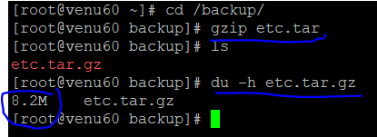
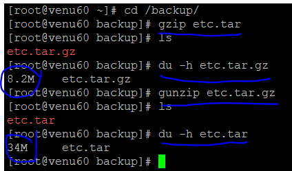
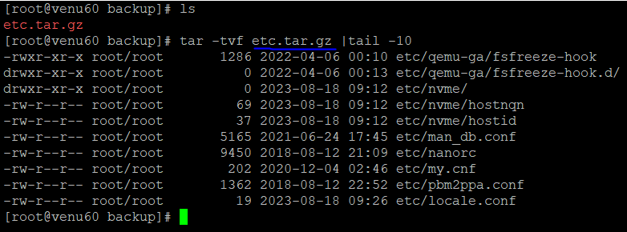
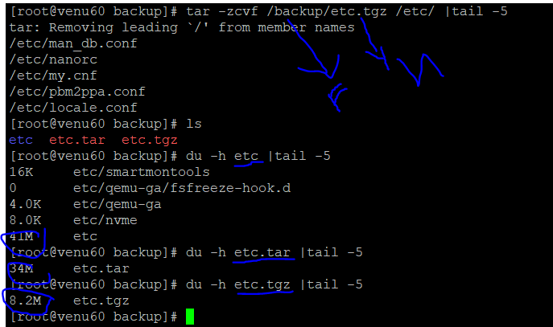
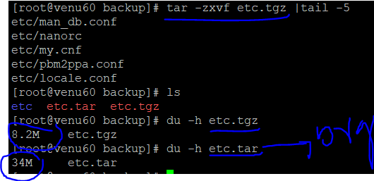

### BACKUP & RESTORE


* To find the folder were we want to take backup & name to create a bakup folder
```
 .du -h /etc
``` 
 
 

* To take the backup for the folder or file we can
 ```
 .tar -cvf /backup/read.md /etc
 ```
 

 ```  
   .backup => folder/directory
   .etc.tar=> name of the backup
   .etc => stored data
   .cd /backup
 ```  
 ```
 . inside the directory we can take the backup
 ```
 

 .compressing the data by using 'gzip,unzip command 
 ```
 .du -h etc.tar.gz
 ```
  
 ```
 .gzip etc.tar
 ```
 
 

 ```
 gunzip extra the data
 ```
 

```
. extrating the data and backup
```
 

```
. take backup together and gzip
```
. tar -zcvf /backup/etc.tgz /etc/ |tail -5
 


```
.extra the data for each create a file
```



 
 
     


    
 

