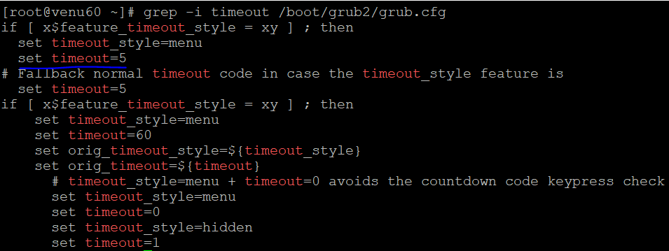
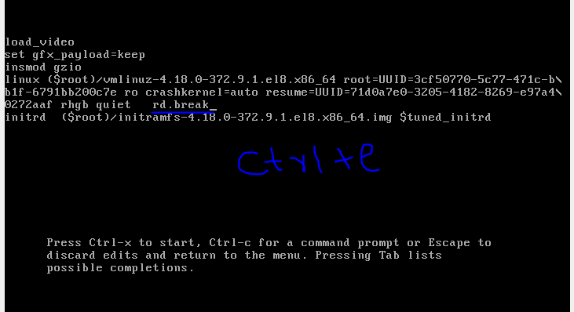
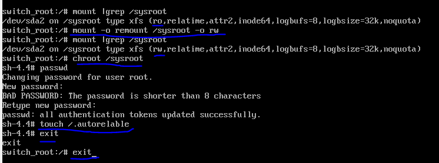

### Time booting Process:
* checking kernel details
  ```
  uname 
  uname -a
  uname -r
  arch
  rpm -qa kernel
  ```
  
  

*  default system boot time
  ```
  grep -i /boot/grub2/grub.cfg
  ```
   
*  manually change and set system boot time again login into system bootin processes
   ```
   vim /etc/default/grub
   ``` 
   
   cat /etc/default/grub |grep -i grub_timeout |sed '/GRUB_TIMEOUT/s/5/10/' |sed -e 's/^/#/'
 * after changes system boot timings to fix  permanent
   ```
   grub2-mkconfig -o /boot/grub2/grub.cfg
   ```  

##### Defaults run levels modes:
  
* command line run level mode
* graphical run level mode 
  ```
  who -r
  systemctl get-defaults
  cat /etc/inittab
  ```  
  
* changing run levels graphical mode to command line mode
  ```
  vim /etc/inittab
  systemcl get-default 
  systemctl set-default runlevel3.target (commandline mode)
  systemctl set-default runlevel5.target (graphical mode)
  who -r  
  ```  
  


#### LOST THE ROOT PASSWD:
* break the booting by pressing `e` in the terminal
  ```
  rd.break and  press ctrl+x
  mount |grep sysroot
  remount -o remount /sysroot -o rw
  mount |grep sysroot
  chroot /sysroot
  passwd
  touch /.autorelable
  exit
  exit

  ```
   
  

* if root password is successfully updated and not login into terminal we can troubleshoot the disk `/dev/sda`
  ```
  .connect dvd into virtual box
  .troubleshoot
  .continue 
  .chroot /mnt/sysroot
  .grub2-install /dev/sda
  .exit
  .poweroff
  ```

  

#### TROUBLESHOOT FOR INSTALLING BOOT LOADER :

* if boot loader is failed we can boot with dvd

* choose the dvd path in the virtual box setting and connect to it.

* To check the details for last  system booting times
```
 .cat /var/log/boot.log
 .poweron
 .Troubleshoot
 .rescure a rhel
  1.continue
  2.read-only mount
  3.skip to shell
  4.quit
* 1.continue
   .enter
    .chroot /mnt/sysroot

 * to check the disk boot (*)  
    .fdisk -l |more
    .grub2-install /dev/sda
   .exit
   .poweroff 
   ```
#### Note:if we install boot loader in dvd(rhel8) 
* grub2-install /dev/sda
    ```
     1.if not login into root passwd we connect (dvd rhel8 inside)
     2.boot with disk `/dev/sda`
     3.grub2-install /dev/sda
     4.remove the dvd in virtual box setting
     5.now poweron the machine we can login into the terminal  
    ```
     