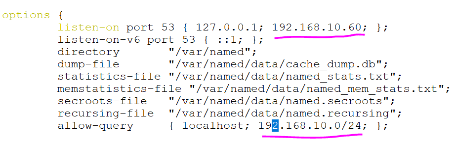
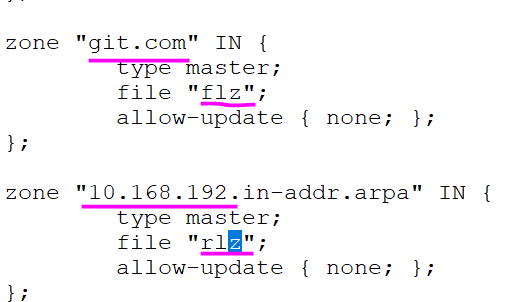
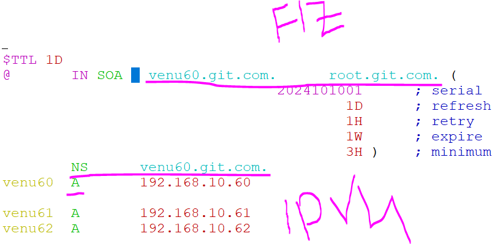
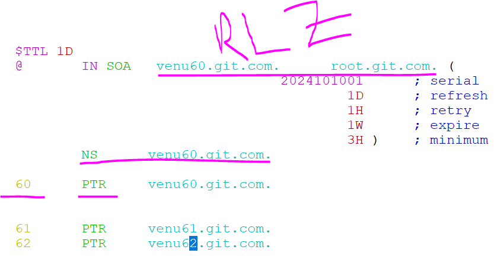
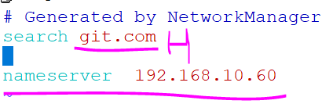
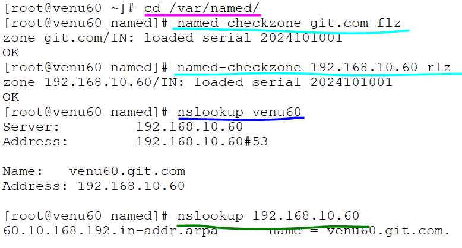

### DNS SERVER 
 https://www.site24x7.com/learn/dns-record-types.html

* converveted <ip-address into names> and <names into ip-address>
* hostnamectl set-hostname venu60.git.com
* package:bind -y
* port no:53
* configuration file:/etc/named.rfc1912.zones 
                     :/etc/named.conf
*                    :/etc/reslov.conf
* dnf install bind -y

 .vim /etc/named.conf

 ``` 
    options {
        listen-on port 53 { 127.0.0.1; 192.168.10.60;  };
        listen-on-v6 port 53 { ::1; };
        directory       "/var/named";
        dump-file       "/var/named/data/cache_dump.db";
        statistics-file "/var/named/data/named_stats.txt";
        memstatistics-file "/var/named/data/named_mem_stats.txt";
        secroots-file   "/var/named/data/named.secroots";
        recursing-file  "/var/named/data/named.recursing";
        allow-query     { localhost; 192.168.10.0/24;  };
 ```   
     

#### forward zone and revers zone lookup zones     

 .vim /etc/named.rfc1912.zones
 
 ```

   zone "1.0.0.127.in-addr.arpa" IN {
          type master;
          file "named.loopback";
          allow-update { none; };
  };
  
  zone "0.in-addr.arpa" IN {
          type master;
          file "named.empty";
          allow-update { none; };
  };

-----------------------------------------
  zone "git.com" IN {
          type master;
          file "my.flz";
          allow-update { none; };
  };
  
  zone "10.168.192.in-addr.arpa" IN {
          type master;
          file "my.rlz";
          allow-update { none; };
  };
   
 ```
 
  
  ```
  .cd /var/named
  .ls 
    named.localhost
  .cp  named.localhost my.flz
  .ll
    root  root   152 Nov 15 10:00 my.flz

  .for same permission named group
  .cp -p  root  named  152 Feb 16  2022 my.flz
  ```

####  FORWARD LOOKUP ZONE
* cd /var/named
* ls
* cat named.localhost 
 
 . cd /var/named vim my.flz

 ```
 $TTL 1D
@       IN SOA venu60.git.com. root.git.com. (
                                        20231115        ; serial
                                        1D      ; refresh
                                        1H      ; retry
                                        1W      ; expire
                                        3H )    ; minimum
        
        
        NS      venu60.git.com.

venu60  A      192.168.10.60


venu61  A      192.168.10.61
venu62  A      192.168.10.62
 
 ```
 

* to test the file fuctioning 

 ``` 
 .named -checkzone git.com my.flz 
 ```


#### FOR REVERSE LOOKUP ZONE 

* for reverse lookup zone
  cp -p my.flz my.rlz
 .cd /var/named vim my.rlz

 ```

   $TTL 1D
@       IN SOA venu60.git.com. root.git.com. (
                                        20231115        ; serial
                                        1D      ; refresh
                                        1H      ; retry
                                        1W      ; expire
                                        3H )    ; minimum
        NS      venu60.git.com.

60      PTR     venu60.git.com.
61      PTR     venu61.git.com.

 
 ```
 

 ```
 .named-checkzone 192.168.10.60 my.rlz
 ```

 .cd
 ```
 .firewall-cmd --add-service=dns --permanent
 .firewall-cmd --reload
 .firewall-cmd --list-all
 ```
 ```
 .systemctl status named
 .systemctl enabled --now named
 .systemctl restart named
 ```

*  vim /etc/resolv.conf
* add name servers in /etc/eslove 
 ``` 
    ### Generated by NetworkManager
    search git.com


  nameserver 192.168.10.60

 ```
 

* ping -c venu60
* ping -c 192.168.10.61
 
 ```
   [root@venu60 named]# nslookup venu60
  Server:         192.168.10.60
  Address:        192.168.10.60#53
  
  Name:   venu60.git.com
  Address: 192.168.10.60
  
  [root@venu60 named]# nslookup 192.168.10.60
  60.10.168.192.in-addr.arpa      name = venu60.git.com.
  
 ```
 

