### HARD DISK PARTITIONS

#### DOC/GPT

* how many partitons are update in kernel 
  ```
  cat /proc/partitions
  ```

* how to update the kernel

  ```
  partprobe
  ```

* create a new partitions 

* check how many partitions 
  ```
   fdisk -l
   ```

* make a new partition first create extended partition  and after than create logical partitions 

  ```
  fdisk /dev/sda
  ```
  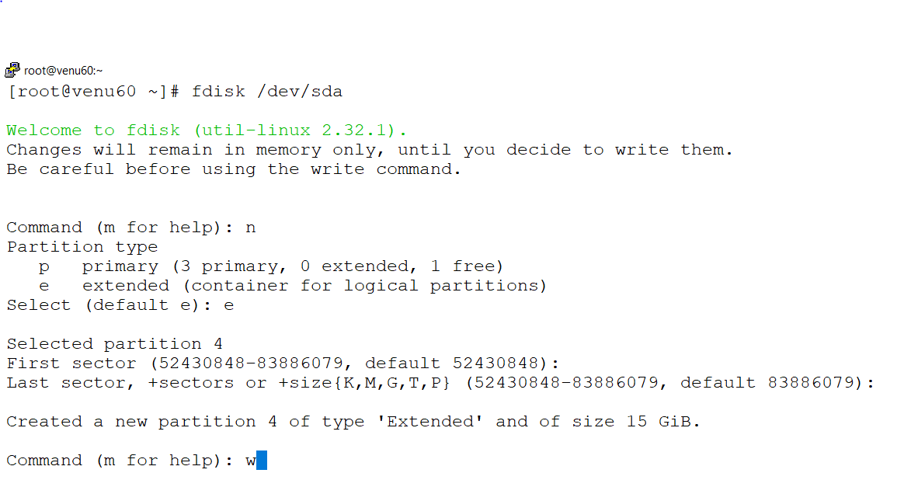  
  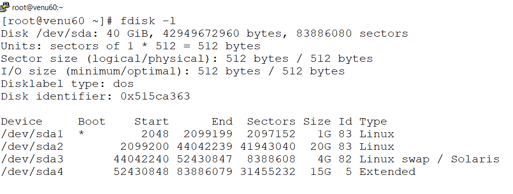

* create a new logical partition 

  ```
  fdisk /dev/sda
  ```
  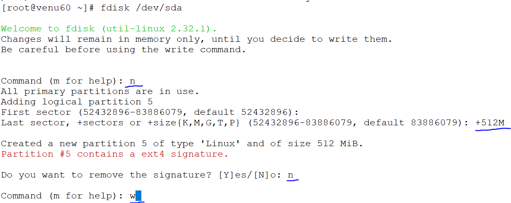
  ```
  lsblk -f -->shows what type of partitio and which type of file system attached
  blkid
  df -h
  df -hT
  ```
* formate the file system to the partition ext4/xfs

  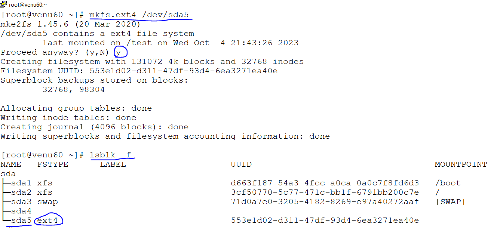

* mount with the directory with partition & create a new directory with names as /test

  ```
  mount /dev/sda5 /test
  ```
  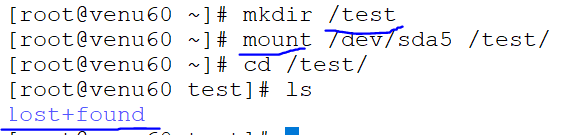
  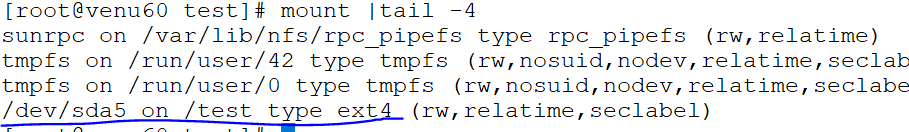 

* make a permanent mounting for a new partition fstab

  ```
  vim /etc/fstab
  ```
  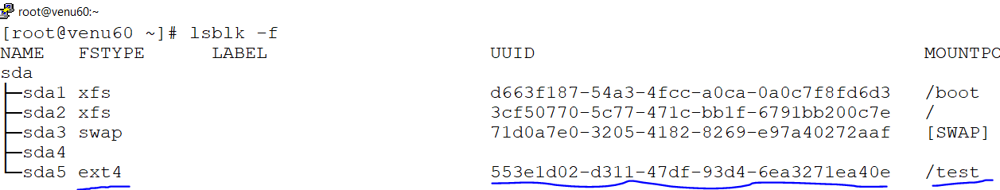
  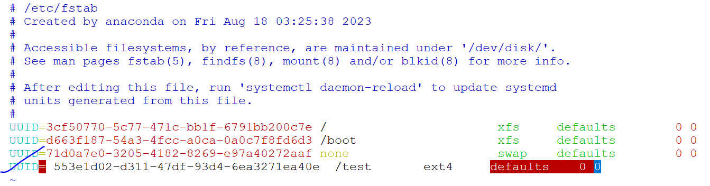
* after permanent mounting  

  ```
  UUID-->device name
  /dir-->mount point
  ext4/xfs-->file system
  defaults-->mount option
  0 0-->dumping,check squence (fsck)
  ```
* after permanent mounting we execute  
  ```
  mount -a
  ```
  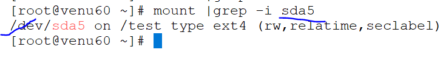

* umount & remount
  ```
  umount /test
  mount /dev/sda5
  ```

* if someone user login into mount directory,
* as a root user when we umount the directory,mount directory will not be umount
* we can be check it out who inside the directory

  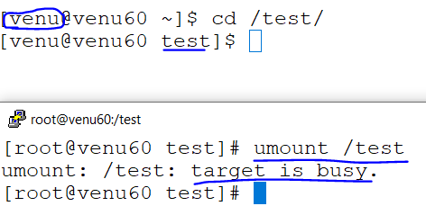

* check the who is inside the directory 

 ```
 lsof /test
 ```
 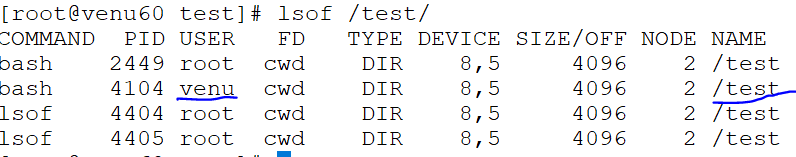

* send the message to user who login into directory `ctrl+d` is sending message to the user

 ```
 write venu
 ctrl+d
 ```
 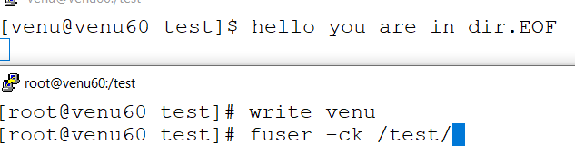

* forcefully to remove the user from directory
 ```
 fuser -ck /<directory_name>
 ```
* permanent mounting in fstab
  vim /etc/fstab
  ```
 
  UUID      mount<directory>     filesystem <ext4/xs>  defaults(mount option)  0 0(dumping,check sequence fsck)

  ```
* after permanent mounting,we execute a command as 
  ```
  mount -a
  ```
* troubleshoot in `fstab` when enter the wrong data 
* when we poweron the machine system will be booting then
* skip the booting 
  ```
  CONTROL-D
  ```
## with parted command 

*  parted -l 
   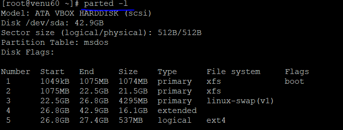

* create a new partition with parted command

*  ```
   parted /dev/sda
   ```   
  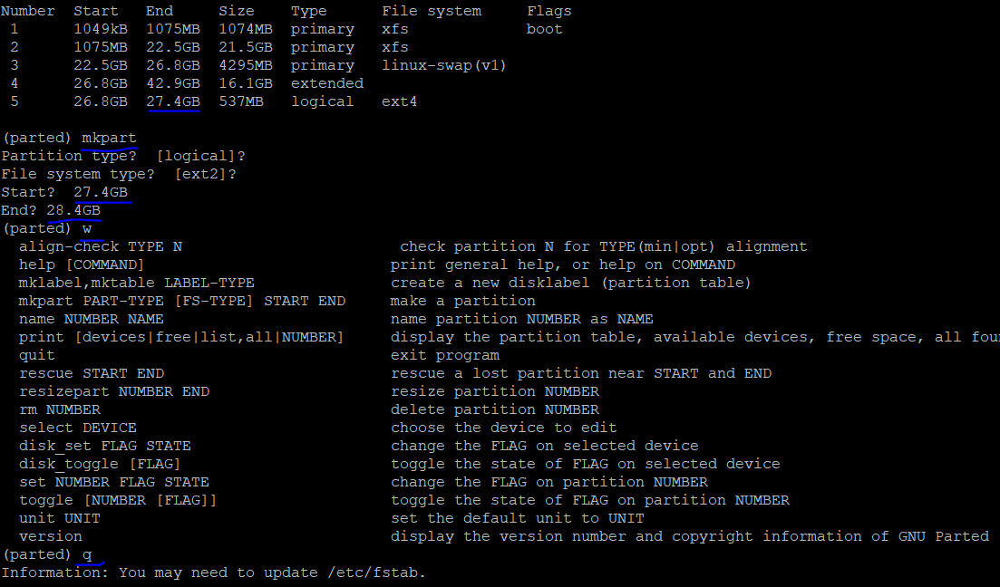
  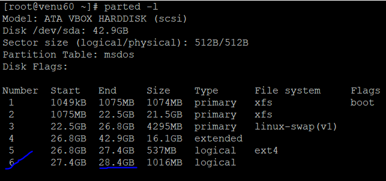

* to remove the partition 
  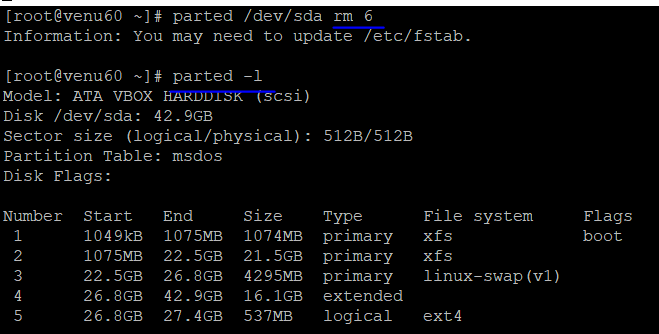

* formating ,mounting same as above images (images/disk4)

####  GPT

  starting size is previews disk size and end  sizes is it's own  size as per GB/MB
*  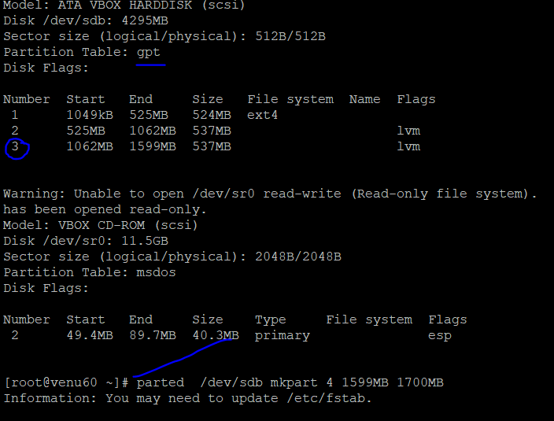
   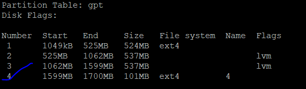


   
  


  
  
