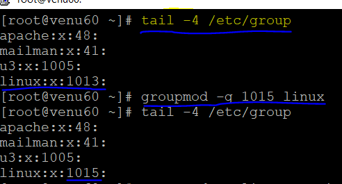
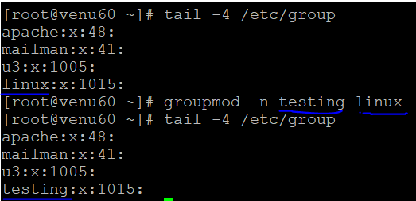
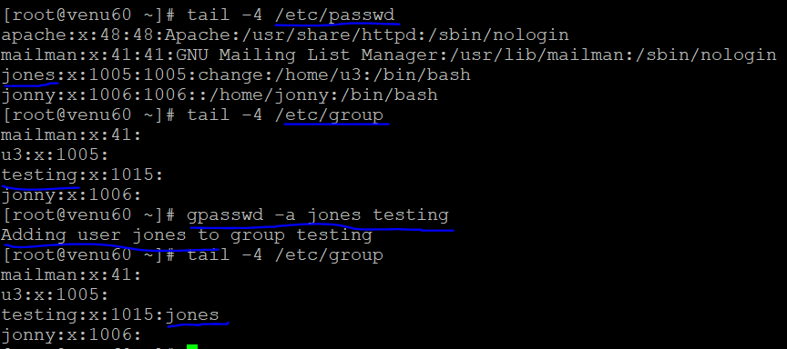
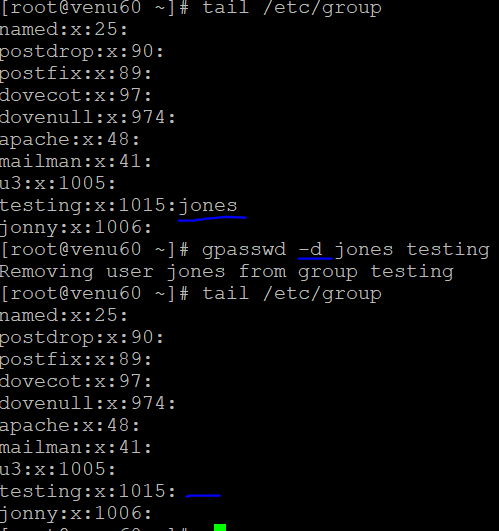
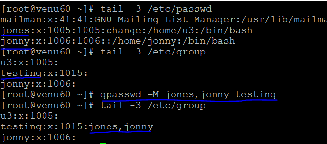
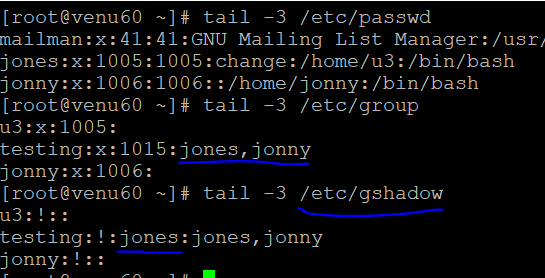

### GROUP ADMINISTRATION:

* check were is group presant
  ```
  tail /etc/group
  ```
* to create a group
  ```
  groupadd <linux>
  ```  
* to change group id 
  ```
  groupmod --help
  g-->(changing the group id)
  n-->(changing the group name)
  groupmod -g linux 
  ```  
  

* to rename the group
  ```
  groupmod --help

  Options:
  -g, --gid GID                 change the group ID to GID
  -h, --help                    display this help message and exit
  -n, --new-name NEW_GROUP      change the name to NEW_GROUP
  -o, --non-unique              allow to use a duplicate (non-unique) GID
  -p, --password PASSWORD       change the password to this (encrypted)
                                PASSWORD
  -R, --root CHROOT_DIR         directory to chroot into
  -P, --prefix PREFIX_DIR       prefix directory where are located the /etc/* files

  groupmod -n <new_name> <old_name>
  ```  
  

* add the user and user's in a group 
  ```
  gpasswd --help

  Options:
  -a, --add USER                add USER to GROUP
  -d, --delete USER             remove USER from GROUP
  -h, --help                    display this help message and exit
  -Q, --root CHROOT_DIR         directory to chroot into
  -r, --delete-password         remove the GROUP's password
  -R, --restrict                restrict access to GROUP to its members
  -M, --members USER,...        set the list of members of GROUP
  -A, --administrators ADMIN
  ``` 
  ```
  gpasswd -a <user_name> <group_name>
  ```
* to add a user in a group
  ```
  gpasswd -a <user_name> <group_name>
  ```
  

* to delete the user in a group
  ```
  gpasswd -d <user_name> <group_name>
  ```
  

* to add a multiple member's in agroup
  ```
  gpasswd -M <no.of user's> <group_name>
  ```  
  

* to make a admin of a user to the group
  ```
  gpasswd -M <user_name> <group_name>
  tail -4 /etc/gshadow
  ```  
  

* to the group 
  ```
  groupdel <group_name>
  ```  
