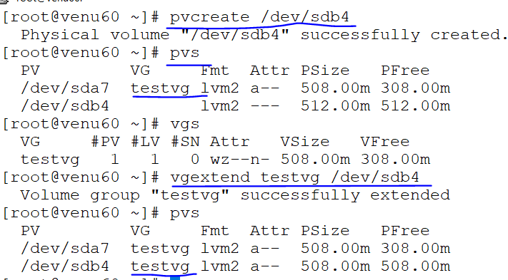
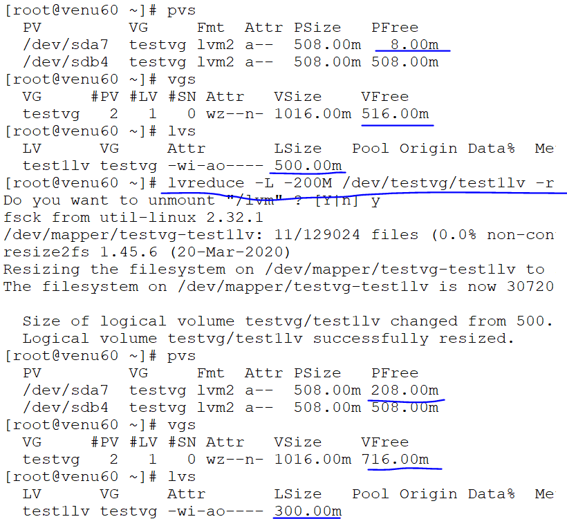

### LOGICAL VOLUMES MANAGEMENT  

  `LVM CODE (DOC-8E,/DEV/SDA) (GPT-31,/DEV/SDB)`
  ```
  physical volume (PV)
  volume group (VG)
  logical volume (LV)
 ```
* minium size is to create the physical volume `512 MB`
* each extend size is `4MB`
* one extend size is occupies `metadate` stores the `PV'S,VG'S,&,LV'S`

* to calculate the sizes size/4

* create a physical volume PV
* to convert the lvm code  `8e` linux lvm

* create a partition for volumes
  ```
  fdisk /dev/sda
   n
   t
   l
   8e (lvm)
   w
  ```
  
  ```
  pvcreate /dev/sda7 
  vgcreate testvg /dev/sda7
  lvcreate -L 300M -n test1lv testvg
  formate the file system ext4
  mount the partition to create a pv,vg,lv
  mount |tail -4
  ```
  
   
   

* permanent mounting 
  ```
  vim /etc/fstab  
  ```
  
  

* to remove the `PV'S ,VG'S,LV'S`

  ```
  pvremove /dev/sda7
  vgremove testvg -f /dev/sda7
  lvremove test1lv
  ```

### EXTEND THE VOLUME SIZES ONE DISK TO ANOTHER DIFFERENT DISK
* create two physical volume's and 
* create one volume group
* create logical volume
*  to extend the volume group to the physical volume
* to resize/reduce to the volume group

* `/dev/sda to /dev/sdb`

*  ```
   fdsisk /dev/sdb
   n
   +512M
   t
   l
   31(LVM)
   w
   ```
*  fdisk -l
  

* to extend the `logical volume group` extisting the physical volume `sdb7 to sdb4`

   ```
   lvextend -L +200M /dev/testvg/test1lv -r
   lvreduce -L -200M /dev/testvg/test1lv -r
   ```
  
  
   
   
  

* mounting,file system permanent mounting same as previous above screenshot  
  
* if we delete lvm & again restore the lvm
  ```
  .cd /etc/lvm
  ls
      archive  backup  cache  lvm.conf  lvmlocal.conf  profile
  .cd /etc/lvm/archive

  .ls -ltr
  .vgcfgrestore -t testvg -f <file-name>
  ```
  

* to activate `LVM`
  ```
   lvchange -a y /dev/testvg/test1lv
  ```
  

### to move the data one pv to anothother pv
* pvmove /dev/sda7 /dev/sdb4
   
  ```
  pvdisplay -m /dev/sda7 
  pvdisplay -m /dev/sdb4
  ```
  

* pvmove /dev/sdb4 /dev/sda7
  
  ```
  pvdisplay -m /dev/sda7
  pvdisplay -m /dev/sdb4
  ```
  

* ```
  mkfs.ext4  /dev/testvg/testlv
  mount /dev/testvg/testlv /lvm
  pvremove /dev/sda7
  vgremove -f testvg
  lvremove -f test1lv
  ```  
* if lv delete and restore again
    ```
    cd /etc/lvm/archieve
    ls -ltr
    vgcfgrestore -t testvg -f testvg_00009-960783674.vg 
    ```
* to activate for lvm
  ```
  lvchange -a y /dev/testvg/testlv
  ```       
* Note:-
 .if we already volume group/logical volume as a name
 .we can delete that volumes in
  ```
  cd /etc/lvm
  ls
  ```  
  


