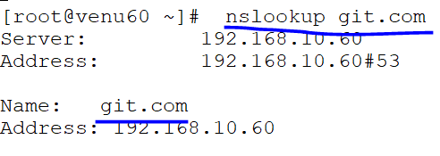

# MAIL SERVER

### port.no:25 smtp
### packages:postfix and dovecot
### configuration file:/etc/postfix/main.cf
###                   :/etc/dovecot/dovecot.conf 
### daemon:postfix,dovecot


#### from server side (60)

* we can install postfix and dovecot* packages
```
dnf install postfix* dovecot* -y
```
  
* vim /etc/postfix/main.cf
  se nu
  ```
    94=
    102=
    118=
    132=
    135=
    182=
    183=
    283=
    336=
     
  ```
  
  
  
  
  
  

* vim /etc/dovecot/dovecot.conf
* line 24 uncomment & delete submission woard
   
   
  ```
  .systemctl status postfix dovcot
  .systemctl enable --now postfix dovecot 

  ```
  
  ``` 
  .firewall-cmd --list-all
  .firewall-cmd --add-service=smtp --permanent
  .firewall-cmd --reload

  ```
  

  ``` 
  .cd /var/named
  .vim /var/named/my.flz  
  ``` 
   
   

   ```
   .dnf install mail* -y
   ```
   
 

 ### from another machine 61
 #### lab-setup

* dnf install postfix mailx -y
 ```
 .vim /etc/postfix/main.cf
 
 (132,336) uncomment the line
 (135)# comment the the line
 ``` 
 

 
  

* systemctle enable --now postfix
  
 ```
 firewall-cmd --add=service=smtp --permanent
 firewall-cmd --reload  
 firewall-cmd --list-all

 ```
 

 ```
 mail -s test root@venu60.git.com 
  after write the message 'ctrl+d' is sending mail
 ctrl+d
 ```
  

* check the other machine60 we get mail message

  

* for relpying the another machine and quit after relpying

 ```
 .r
 ```
  

 ```
  .mailq
  for checking previous mails details 
  .cd /var/spool/mail
 ```
 
  


