### NETWORKING:
* networking:  connection b/w two or machines to communicate each other 

#### Basic requirments:
* NIC (network interface controller)
* Media(wired cables,wirless cables)
* Topology(to design network for computer)
* Protocal(https,ftp uses tcp)
* ip(ifconfig)

* Nic:nic is a `hardware component` is connect to computer and computer is connect to network

* media:nothing but cables (wired/wirless)connect to two or more systems

* topology:way define structure how components are connected to each other ex:star,bus,ring...

* protocal:define rules and communication between network device and protocal (ipv4 & ipv6)

* ip:every computer have to assign a ip address to identify each one to communicate in the network

#### configuration files:
  
* hostnamectl set-hostname venu60.git.com

* cat /etc/sysconfig/network-scripts

*  This directory keeps the configuration of network devices 
connected to the system. Examples are ifcfg-enp0s3

* vim /etc/hosts
  
* responsible for hostnames into ip's

* vim /etc/reslov.conf
  
*  the file keeps the addresess the dns server to which client will be access connect for resloving hostname into ip's  addresses

#### NMCLI=>(network manager command line interface)

*  ```
   .nmcli 
   .nmcli con show
   .nmcli con add con-name `linux` ifname enp0s8 type ethernet ipv4.method manual ipv4.addresses 192.168.10.60/24 ipv4.gateway 192.168.10.1 auto connection no
   .nmcli con up linux
   ```
*  check ethernet adapters
  ```
  nmcli con show linux
  ```
  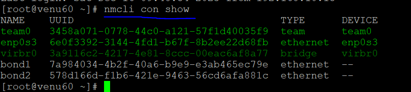  

* add one more adapter in virtualbox

  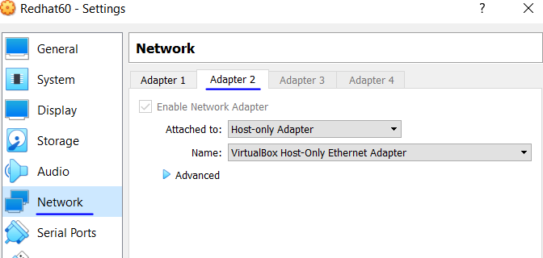

  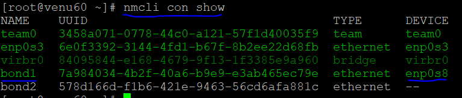

  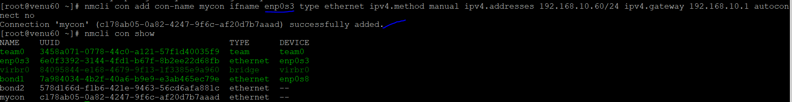
  
* activate the connection name as `linux`  
  
* nmcli con up linux

  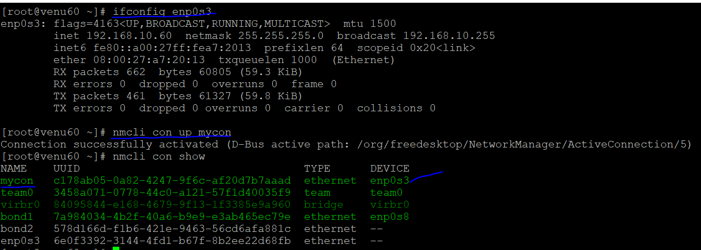

* check the status of gateway
  
* netstat -nr :shows which ip is connected to which type of adapter
  
  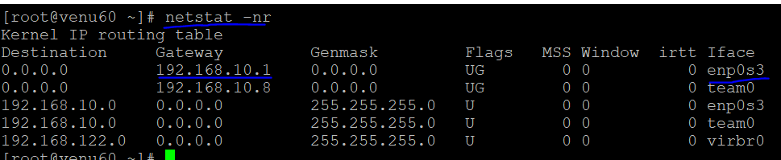
  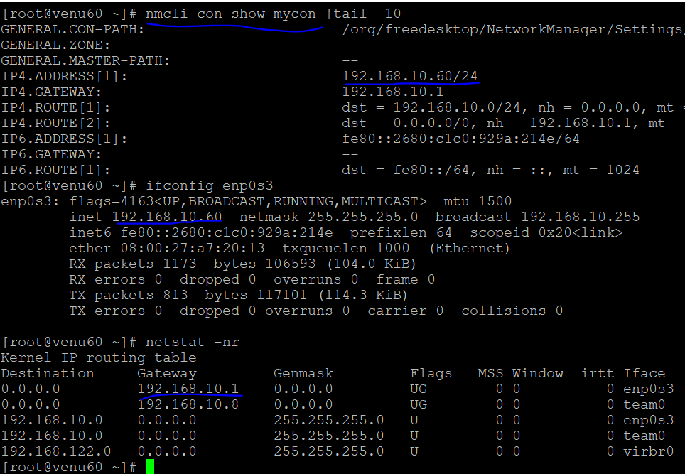

*  check the adapter speed  by using `ethtool`
  
* ethtool enp0s3 |grep -i speed
  
  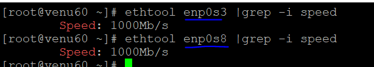

*  modified the connection and delete the connection
  
* nmcli con modify linux connection.autoconnect yes ipv4.addresses
  192.168.10.65/24
* nmcli con show linux  

* delete a connection  
* nmcli con mod del venu

* nmcli con show 
   
  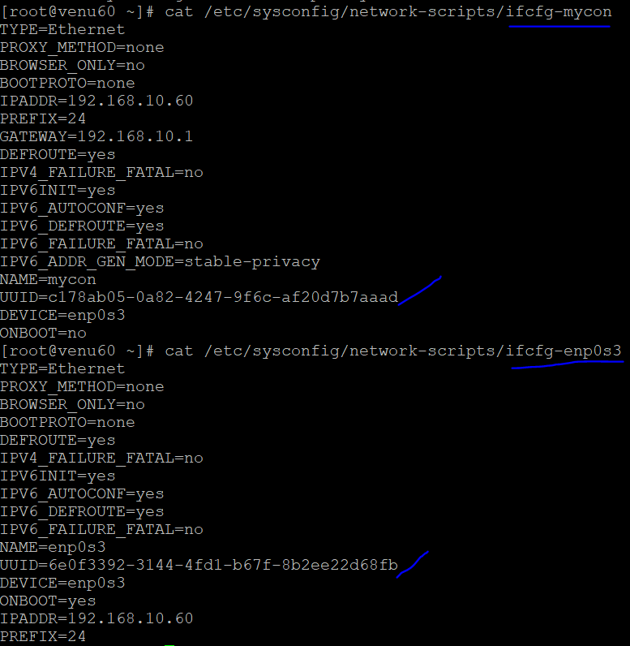

#### nmtui=>(network manager test user interfer)
   
  

* [Refer](https://www.interserver.net/tips/kb/network-bonding-types-network-bonding/)

#### Nic-teaming:

* teamd:is responsible for activate
* teamdctl:says type of config
*  runner:
* mode0:roung-robin
* mode1:active-backup
* mode2:load-balance
*  create an a nic team for new adpater 
    
* nmcli con add con-name `nic` type team ifname `team` config  {"runner": {"name":"activebackup"}}

* nmcli con show
* nmcli dev status
    
  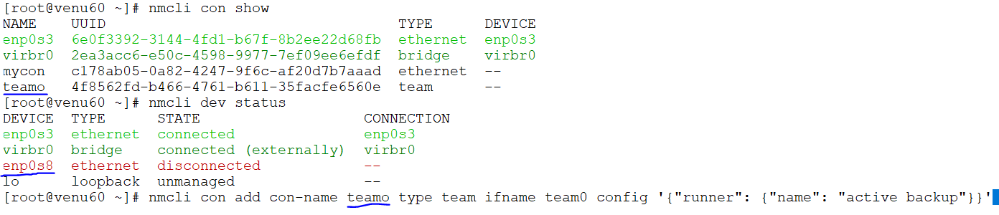
* add ip-address of connection name
  
* nmcli con mod `nic` connection.auto connect yes ipv4.method manual ipv4.addresses 192.168.10.90/24
* nmcli con show `nic`
  
  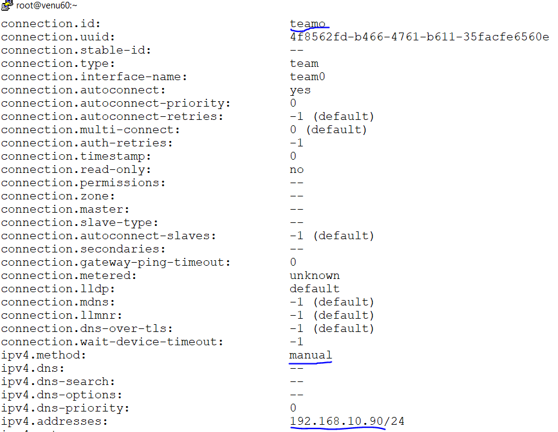
* adding team-slaves to con-name `slave`
* master is manage to slaves 
        
* nmcli con add con-name `slave1` type `team-slave`  ifname `enp0s8` master `team`

* nmcli con add con-name `slave2` type `team-slave`  ifname `enp0s9` master `team`
    
* nmcli con show `nic` 

* 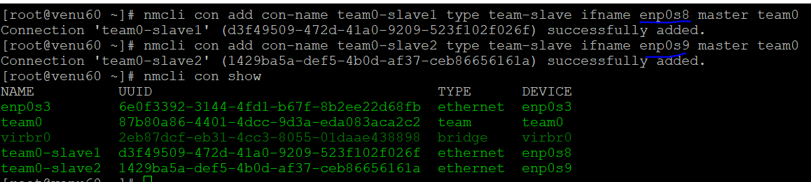

* nmcli device connecte enp0s8
* nmcli con up `nic`
 
* 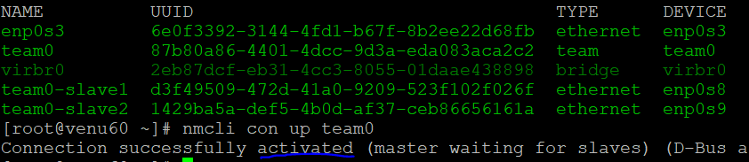

* teamdctl `team` state  team=>master
   
 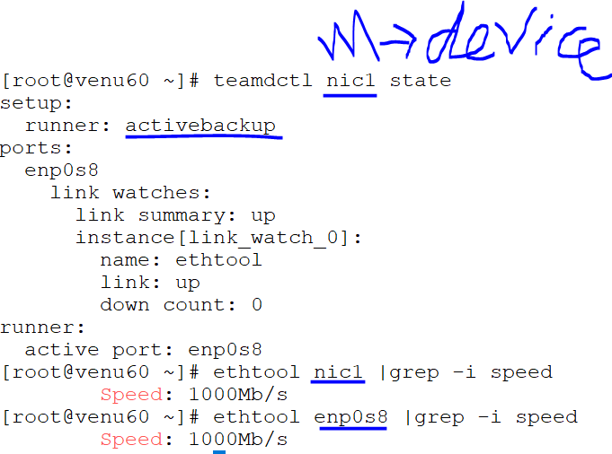
 
 ```
 .nmcli connection modify nic config '{"runner": {"name":"activebackup"}}'
 ```
 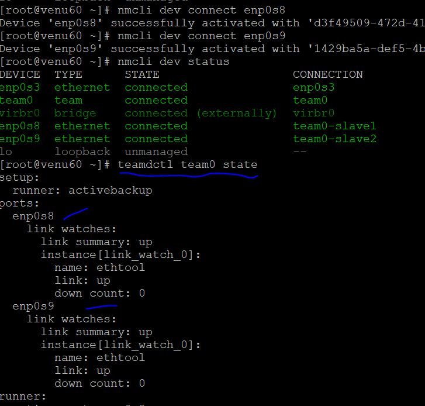
       
* ethtool enp0s8 |grep -i speed 
* ethtool enp0s9 |grep -i speed
* ethtool team  |grep -i speed
* nmcli dev disconnected enp0s8
    
 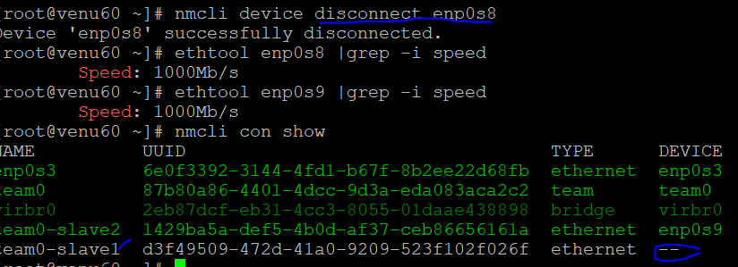

* modify the json template with connection name `team` 
 
  
* nmcli connection modify nic config '{"runner": {"name":"loadbalance"}}'
  
* nmcli con up nic

* teamdctl `team` state  team=>master(device_name)

 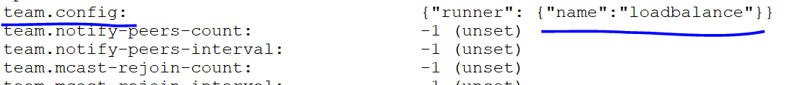

 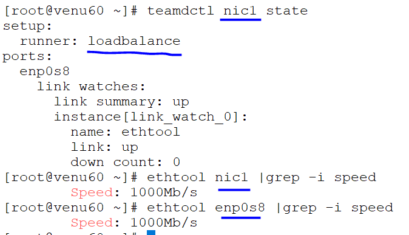


    


     
     
    
      

