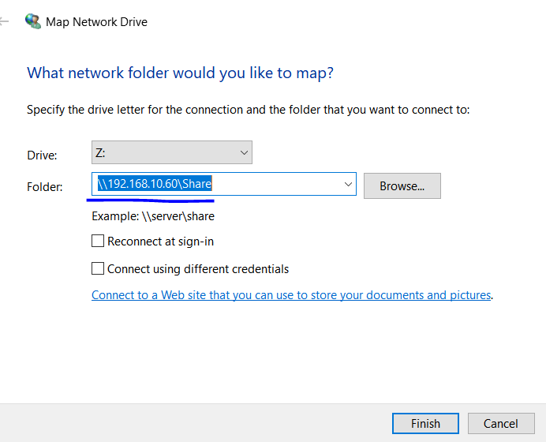
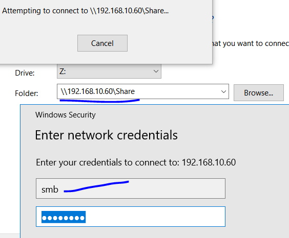
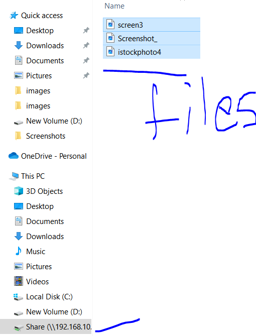
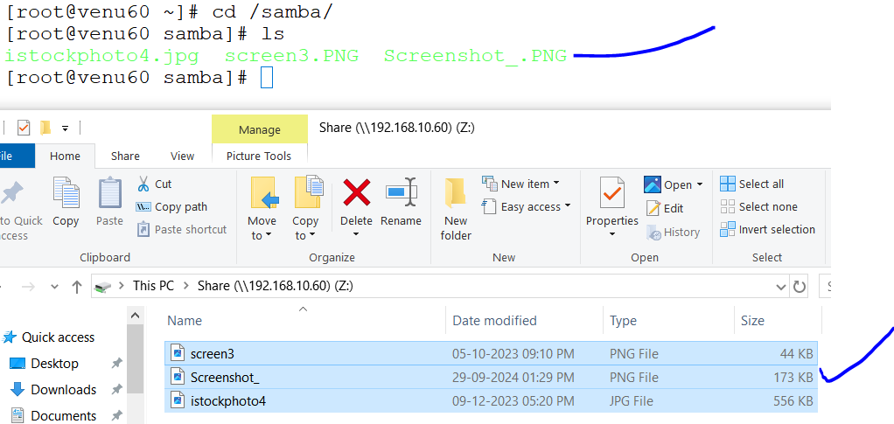
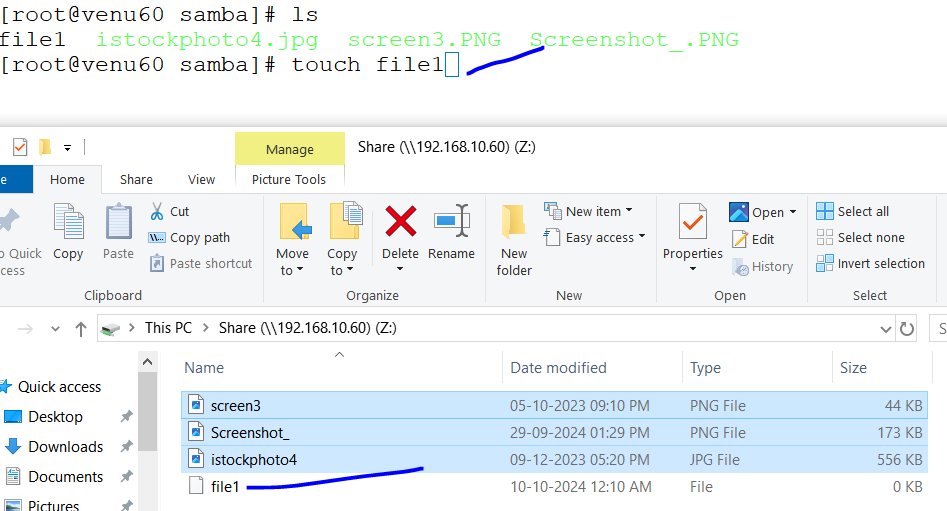
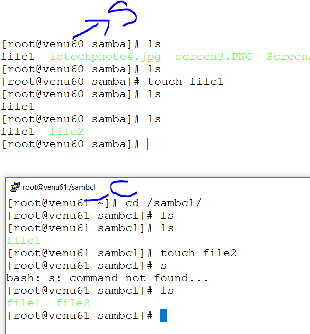
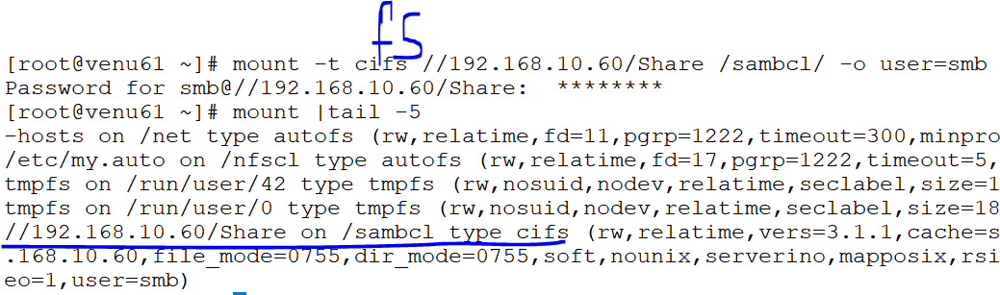

## NFS (NETWORK FILE SYSYEM)
* NFS:network file system
* port: 2049
* package: rpm -q nfs-utils
* configuration file: /etc/exports

### Lab set-up on server side (192.168.10.60)

* To commnicate from server to any other machines like 192.168.10.61 ,62
* create a directory name as </nfs>
 ```
 .mkdir /nfs
 .cd /nfs
 .ls -ld /nfs
 .chmod 777 /nfs
 ```
* why do full permission for directory to access to another machines 

 ```
  vim /etc/exports
  /nfs 192.168.10.0/24 (rw,sync)
  wq!
  exportsfs -rv
 ``` 
  

* check status of a nfs-server.service

 ```
  .systemctl status nfs-server.service
  .systemctl enable --now nfs-server.service
  .systemctl status nfs-server.service
 ```
* if any changes in configuration file we can restart the service 

* add services {nfs,mountd rpc-bind}
  ```
   .firewall-cmd --list-all
   .firewall-cmd --add-service=nfs --permanent
   .firewall-cmd --add-service={mountd,rpc-bind} --permanent
   .firewall-cmd --reload
   .firewall-cmd --list-all
  ``` 

### From client side (192.168.10.61)

* test the communication from server to client
  showmount -e 192.168.10.60
  
  ```
      Export list for 192.168.10.60:
       /nfs (everyone)
  ```     

* create a directory name as </nfscl
* it seems when server upload a data client can be recieve the data
  .mkdir /nfsc
  .mount -t nfs 192.168.10.60:/nfs /nfscl
  .mount |tail -4
    192.168.10.60:/nfs on /nfsc type nfs4
  .cd /nfscl
  .ls
  .umount -f /nfscl
  ```
* if remove the directory first `umount-directory` after then we can  remove


 #### for permanent mounting 
  .vim /etc/fstab
  ```
    192.168.10.60:/nfs   /nfscl   nfs    defaults 0 0
  .wq!
  ```
 .mount -a
 .mount |tail -4
 
#### for auto mounting
* auto-mounting means when we inside the directory to automatical mount the server
* we can install a package `autofs.serverice`
* dnf install autofs -y
* vim /etc/auto.master
  ```
   /- /etc/auto.nfs --timeout=10
  ```   
* vim /etc/auto.nfs
  ```
  /nfscl -rw  192.168.10.60:/nfs 
  ```
* enable the autofs.service
```
 .systemctl enable --now autofs.service
 .systemctl status autofs.service
```
 

* check the mount point 
  .mount |tail -4
  
* can inside the directory
  .cd /nfscl
  .ls

* can outside the directory
  .cd 

* observe the mount point for mention the timeout
 .mount |tail -4


### limitation :
* only it can be connected into linux to linux & linux to unix


## SAMBA SERVER

### for linux machine 192.168.10.61
### daemon:samba
### port no: 449
### configuration file:.cat /etc/samba/smb.conf.example
                       :.cat /etc/samba/smb.conf

* samab server is connect to linux to windows & linux to linux

### Lab set-up
 1.install samba application
  
* create a directory name as /samba
 ```
  dnf install samba* -y
   .mkdir /samba
   .chmod 777 /samba
   .ls -l /samba
   .ls -ldZ /samba
    root unconfined_u:object_r:default_t
   ``` 

* add SELinux labels only on files and directories
 ```
 .chcon -t samba_share_t /samba
 .ls -ldZ /samba
   root root unconfined_u:object_r:samba_share_t:s0 
 ``` 

* remove samba_share_access for directory
 ```
 .ls -lZd /samba
 .restorecon --help
 .restorecon -R /samba
   root root unconfined_u:object_r:default_t:s0
 ```

* add a user for samba server and set password for the user
  ```
  .adduser samb
  .smbpasswd -a <smb> 8- characters (redhat@123)
  .smpasswd -x <smb> remove the samba passwd 
  
  .pdbedit -l
  .pdbedit --help
  .pdbedit -u samb
  ```

* configuration file for samba
 .cat /etc/samba/smb.conf.example
 ```
   [public]
;       comment = Public Stuff
;       path = /home/samba
;       public = yes
;       writable = no
;       printable = no
;       write list = +staff
 ```

* modify and uncomment the file
 ```
  [GitShare]
       comment = my private 
       path = /samba
       public = no
       valid users = samb
       writable = yes
       hosts allow = 192.168.10.

  :wq!
  ``` 
* test the file working or not 
  ```
   .testparm & enter
  ``` 

 * linux to windows 
 ```
* login as windows terminal as
    <PC> right click 
       networkdrives
       \\ip\share-name
  .username smb
  .password samba123
  .disconnect
  ```
  
  
  
* windows to linux  
  
* linux to windows
    
* linux to linux
    

 ### from client side (192.168.10.61) 
* we can install a package 

 ```
  .dnf install samba-client cifs-utils -y
  .dnf install samba-client-libs-4.15.5-5.el8.i686 -y
 ```
* create a directory with name as
 ```
   mkdir /sambacl
   cd /sambacl
   mount -t cifs //192.168.10.60/GitShare /samba1 -o user=smb  
 ```
 
        

 


 


