### SELINUX:(security enancement of linux)
*  modes of selinux:
  .Enforcing
  .permissive
  .disable
* types:  
  .discretionary acess control
  .mandatory access control
  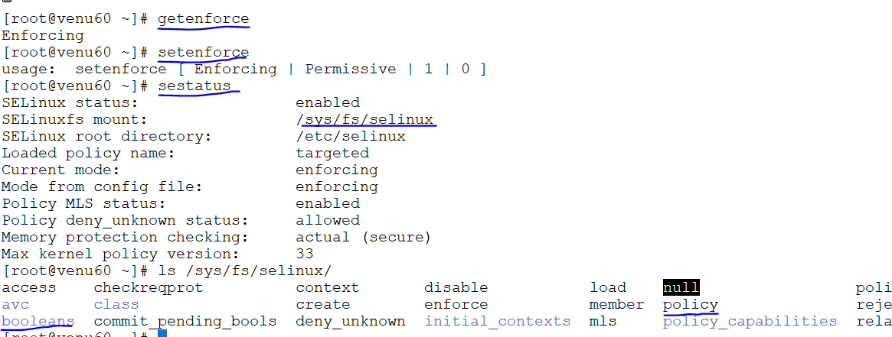
*  to set enforcing/permissive mode
  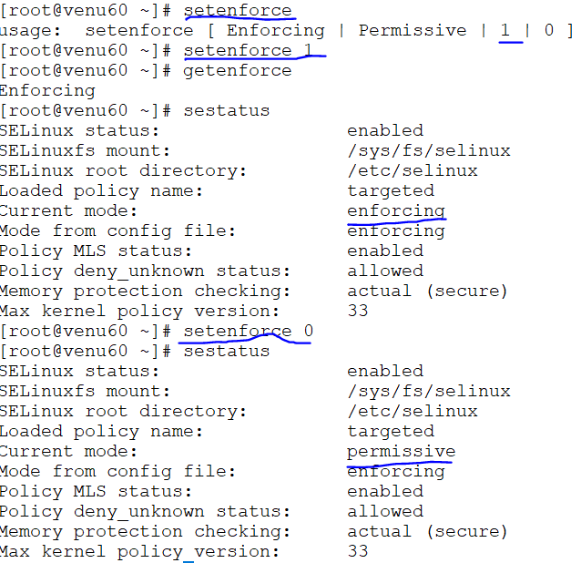
* if system reboots/shuntdown automatically changing the enforcing mode

* if we want set permanent modes in selinux configuration file we can changes enforcing/permissive/disable
  ```
  vim /etc/selinux/config
  ```      
  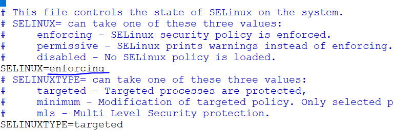
* commands 
  ```
  getenforce
  setenforce enforcing/permissive/disable or 1 | 0
  sestatus
  ```
* applying permissions on files /directorys either publice/httpd/samba access  

  ```
  touch selinux
  ls -lZ selinux
  chcon -t public_content_t selinux
  ls -lZ selinux
  ```
* to remove the permission of the file
* in the directory have files to remove the permissions
  ```
  restorecon -V <name_file>
  restorecon -Rv <name_file/dir.> 
  ```  
  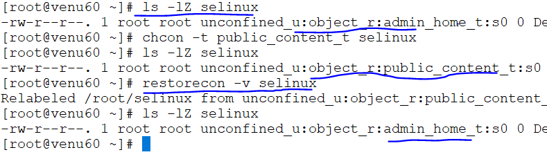
* difference  between files and root file `file /file`
  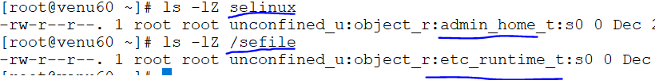
* in directory have file to access to serves
  ```
  chcon -Rt public_content_t user
  ```
  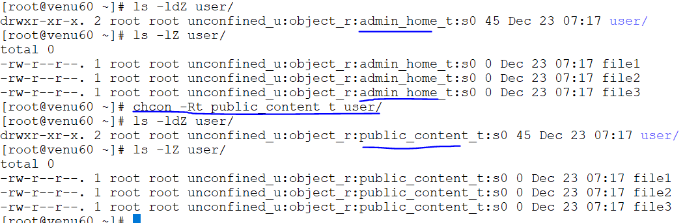
* to remove the access for the directory
  ```
  restorecon -R user
  ```  
  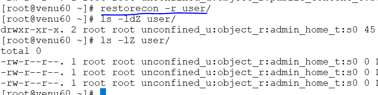

* default context file stored in
  ```
   cat /etc/selinux/targeted/contexts/files/file_contexts.local
  ```  
* if we give samba share/httpd access to a file
  ```
  for <file>
  semanage fcontext -a -t samba_share_t /venu
  ls -lZ /venu
  after than
  restorecon /venu
  ```  
  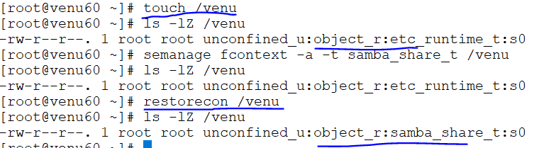
  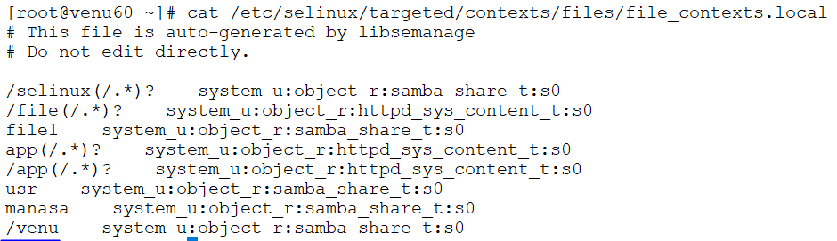
*  for directory
  ```
  semanage fcontext -a -t httpd_sys_content_t /out1
  restorecon /out1
  ls -ldZ /out1
  cat /etc/selinux/targeted/contexts/files/file_contexts.local
  ```
  
  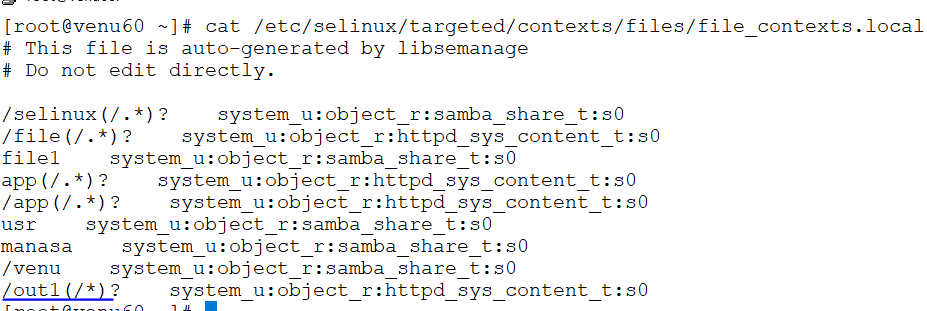
* if any application to apply the files/directories to reset 
the application 
 ```
 semanage fcontext -a -t samba_share_t "/web(/.*)?"
 restorecon /web
 ls -ldZ /web
  cat /etc/selinux/targeted/contexts/files/file_contexts.local
  semanage fcontext --help
  semanage fcontext -d "/web(/.*)?"
 ```
 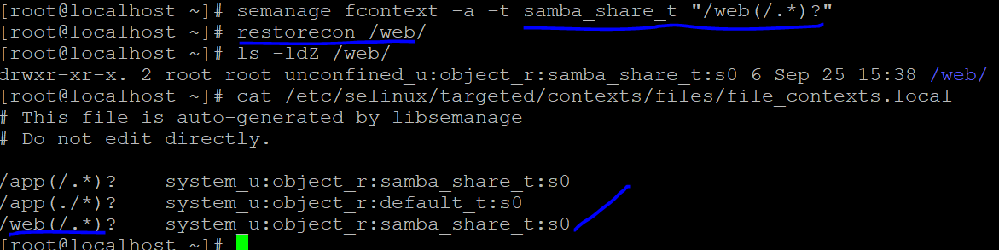
 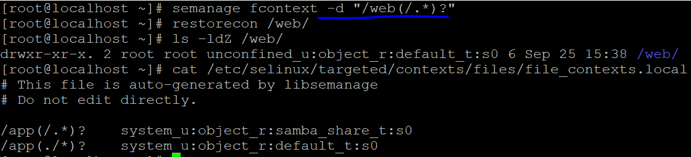
#### Boolean:
  ```
  on/off
  true/false
  0/1
  ```
  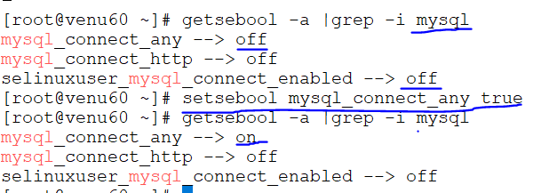

* to connect any server/protocal 
  ```
  getsebool -a |grep -i ftp
  permament mount
  setsebool -p ftpd_anon_write on
  semanage boolean -l |grep -i ftp
  ```  
  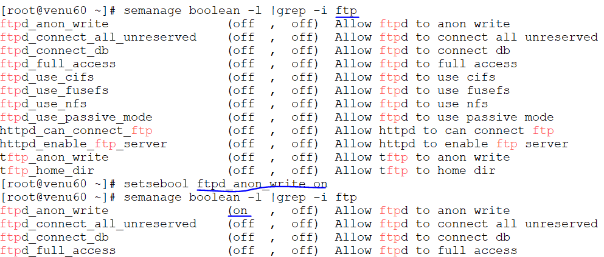
  


