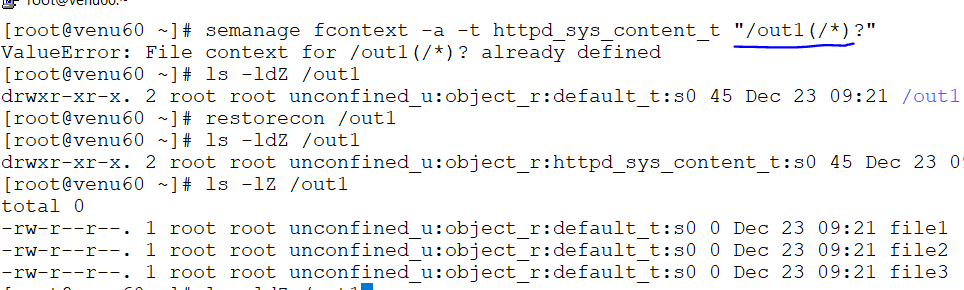

### SELINUX:(security enancement of linux)
*  modes of selinux:
  .Enforcing
  .permissive
  .disable

* types:  
  .discretionary acess control
  .mandatory access control
* Temporary changing:

  ```
  setenforce permissive
  getenforce
  setatus=>full-detail
  ```
  

*  set enforcing/permissive modes

  

* if system reboots/shuntdown automatically changing the enforcing mode

* permanent change:

  ```
  vim /etc/selinux/config
  ```      
  
 
  ```
  getenforce
  setenforce enforcing/permissive/disable or 1 | 0
  sestatus
  ```
* applying permissions on files /directory either publice/httpd/samba access  

  ```
  touch selinux
  ls -lZ selinux
  chcon -t public_content_t selinux
  ls -lZ selinux
  ```
*  remove the permission of the file
* in the directory have files to remove the permissions
  
  ```
  restorecon -V <name_file>
  restorecon -Rv <name_file/dir.> 
  ```  
  

* difference  between files and root file `file /file`
  

* in directory have files to apply public access
  ```
  chcon -Rt public_content_t user
  ```
  

* remove the access for the directory
  ```
  restorecon -R app
  
  ```  
  

* default context file stored in
  
  
*  cat /etc/selinux/targeted/contexts/files/file_contexts.local
    
* if we give samba share/httpd access to a file

* for file  
  ```
  semanage fcontext -a -t samba_share_t file_name
  ls -lZ /venu
 
  restorecon /venu
  ```  
  

  

*  for directory
  ```
  semanage fcontext -a -t httpd_sys_content_t /out1
  
  restorecon /out1
  ls -ldZ /out1

  cat /etc/selinux/targeted/contexts/files/file_contexts.local
 
  ```
  

  

* if any application to apply the files/directories to reset 
the application 

 ```
 semanage fcontext -a -t samba_share_t "/web(/.*)?"
 restorecon /web
 ls -ldZ /web

  cat /etc/selinux/targeted/contexts/files/file_contexts.local
  semanage fcontext --help
  semanage fcontext -d "/web(/.*)?"
 ```
 

 

#### Boolean:
  ```
  on/off
  true/false
  0/1
  ```
  

* connect any server/protocal 

* temporary mount to connect server:  

* getsebool -a |grep -i ftp* 
* setsebool ftpd_anon_write on

* permament mount to connect serer:

 semanage boolean -l |grep -i ftp

 setsebool -p ftpd_anon_write on
  
  
  


