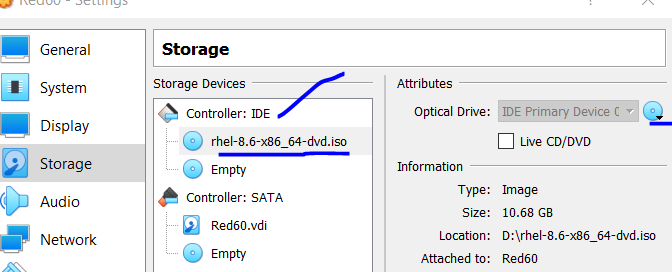
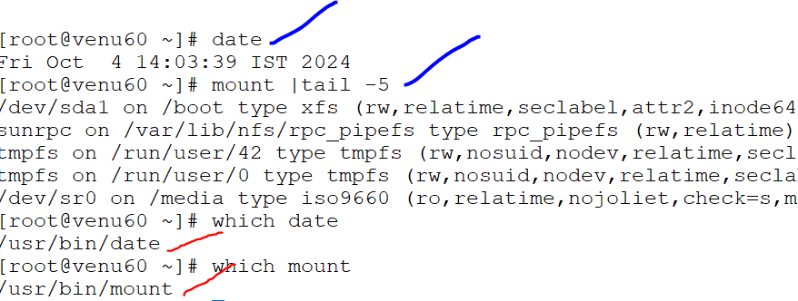
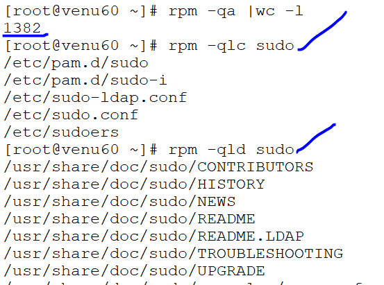

## SOFTWARE MANAGEMENT 

### RPM & YUM(DNF) 

* RPM :Redhat package management

*  connect the dvd into virtual box
 
 ```
  ls /
  mount /dev/sr0 /media (/media default hidden folder)
 ```  

* change the directory to /media
```
 .cd /media
 .ls
  AppStream & BaseOS 
 .cd /media/BaseOS/Packages/
 .ls
```

 
* to install any package we change the directories or we can directly installed

* install,update &remove packages:

  cd /media/BaseOS/Packages/
* to check rpm packages installed or not 
* we can changes the directories or we can installed directly
  
 ```
    rpm -qa <package_name>
    rpm -qi  <package_name>
    rpm -ivh zsh-5.5.1-9.el8.x86_64.rpm  (or)

    rpm -ivh /media/BaseOS/Packages/zsh-5.5.1-9.el8.x86_64.rpm  

    rpm -Uvh zsh-5.5.1-9.el8.x86_64.rpm

    rpm -evh zsh-5.5.1-9.el8.x86_64.rpm
 ``` 

* to verfiy the install package
  ```
  rpm -q zsh
     zsh-5.5.1-9.el8.x86_64
  ```     

* to query the information the package
  ```
  .rpm -qip zsh
  ```

#### Command corrupted (Troubleshooting)

* if any command not working to find out the path of the command
  for example:
  date and mount command
  ```
  which date
  which mount
  ``` 
  
* to verify the package
  ```
  rpm -qf (path of the command)
  rpm -qf /usr/bin/date
  coreutils-8.30-12.el8.x86_64
  ```
* to install the package of the command
  ```
  cd /media/BaseOs/Packages   
  rpm -ivh coreutils-8.30-12.el8.x86_64
  ```
  
* to check the how many configuration files
  ```
  .rpm -qa |wc -l (configuration files list)
  .rpm -qlc sudo (query list configuration)
  .rpm -qld sudo (query list documentation)
  ```


 ### YUM OR DNF:(Yellow dog updater)
 * from server side:
 * first we install the package vsftpd by using rpm and
 * check the status of vsftpd

  ```
  rpm -ivh /media/AppStream/packages/vsftpd
  systemctl status vsftpd
  systemctl enable --now vsftpd
  ```
* if incase not installed the vsftpd
  ```
   cd /var/ftp/pub/venu/
   rpm -ivh vsftpd
  ```  
* we can enable the vsftpd cofig file
  ```
  vim /etc/vsftpd/vsftpd.conf
  # Allow anonymous FTP? (Beware - allowed by default if you comment this out).
    anonymous_enable=YES
  ```  
* check and the firewall

 ```
 fiewall-cmd --list-all
 firewall-cmd --add-service=ftp --permanent
 firwall-cmd --reload
 services: cockpit dhcpv6-client ftp ssh
 ```  
#### From server side
* To configure the repository file
 .vim /etc/yum.repos.d/my.repo
  ```
  [AppStream]
  name=Local_AppStream_repo
  baseurl=file:///var/ftp/pub/venu/AppStream
  gpgcheck=1
  enabled=1
  gpgkey=file:///etc/pki/rpm-gpg/RPM-GPG-KEY-redhat-release

  [BaseOS]
  name=Local_BaseOS_repo
  baseurl=file:///var/ftp/pub/venu/BaseOS
  gpgcheck=1
  enabled=1
  gpgkey=file:///etc/pki/rpm-gpg/RPM-GPG-KEY-redhat-release

  ``` 
* To check weather file fuctioning or not
  ```
  dnf clean all
  dnf provides zsh/ftp/httpd
  ``` 
#### From client side
* To configure the repository file
 ```
 [AppStream]
 name=FTP_AppStream_repo
 baseurl=ftp://192.168.10.60/pub/venu/AppStream
 gpgcheck=1
 enabled=1
 gpgkey=file:///etc/pki/rpm-gpg/RPM-GPG-KEY-redhat-release

 [BaseOS]
 name=FTP_BaseOS_repo
 baseurl=ftp://192.168.10.60/pub/venu/BaseOS
 gpgcheck=1
 enabled=1
 gpgkey=file:///etc/pki/rpm-gpg/RPM-GPG-KEY-redhat-release
 ```
 .dnf clean all
 .dnf provides zsh

* to test ftp working or not in command prompt
  .ftp 192.168.10.60
   ftp
   ls

* From client side to install the Packages and information of the package
 
  ```
  dnf repolist
  dnf list
  dnf list installed
  dnf install zsh -y (BaseOS)
  dnf intall httpd -y (AppStream)
  dnf update httpd/zsh
  dnf info httpd/zsh
  dnf remove httpd/zsh
  dnf grouplist
  ```
 