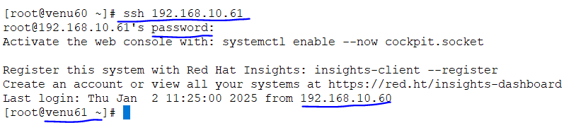
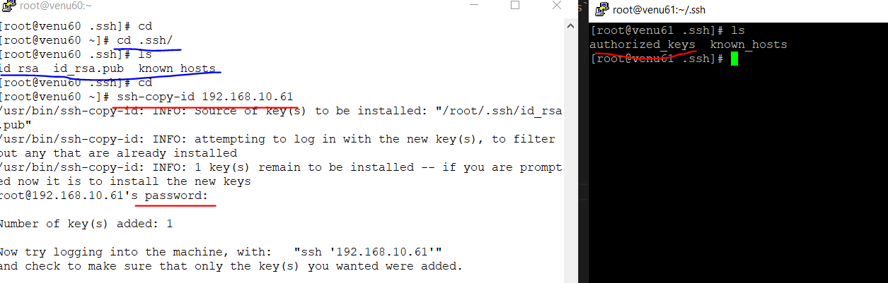

  ### Remote adminstration SSH    
* SSH: secure shell
* one machine to another machine connect each other
* ssh 192.168.10.61
 
 
* in another machine have a user we can possible for login 
  ssh -l v1 192.168.10.61

* only sharing files another machine
  scp file 192.168.10.61:web

* only directories to share another machine
 ssh -r <directory_name> 192.168.10.61:<directory_name>  
  -r -->rescursively 

* RSYNC:same time and same things are available at a time
 
* rsync -avz <dir_name> <ip_addr>:<dir_name>

* if we delete the files/directories we can run the
  rsync -avz <dir_name> <ip_addr>:<dir_name> --delete
 
 #### Password authentication:SSH-KEYGEN

* check .ssh folder if their is no `.ssh`
* type sever ip ssh <ip_addresses>
  
* type `ssh-keygen` one time and enter 3 times

* one server to another server to connect `passwordless` communication
* both machines have create .ssh folders
  
* cd .ssh
  id_rsa  id_rsa.pub  known_hosts

* share public key to another server
  ssh-copy-id <server_addresses>  
  
*  cd .ssh
  authorized_keys  id_rsa  id_rsa.pub
  
  
* transfering data one to one machine with `rsync`
 
* rsync -avz ssh /test1 192.168.10.61:/test2
  a=>archive
  v=>verbose
  z=>zip

*  rsync -avz -e ssh /test1 192.168.10.61:/test2 --dry-run
* for testing use
*  rsync -avz ssh /test1 192.168.10.61:/test2 --delete 