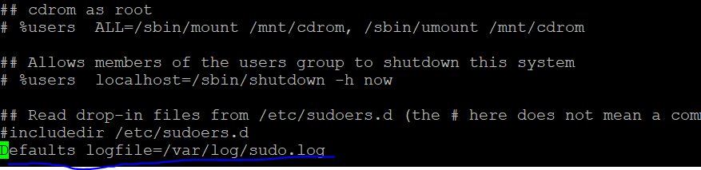
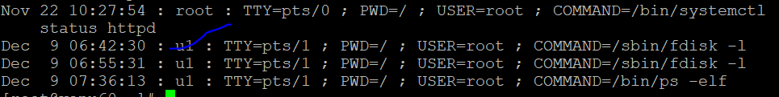
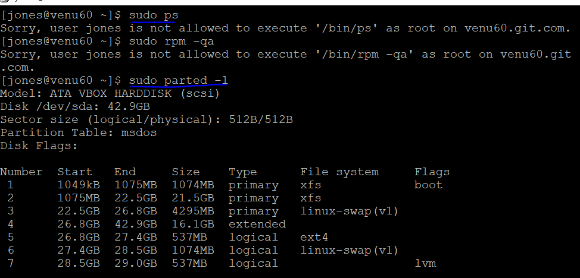
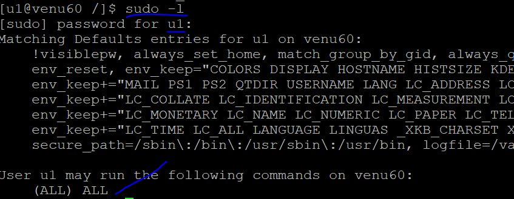
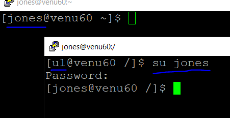
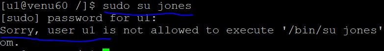
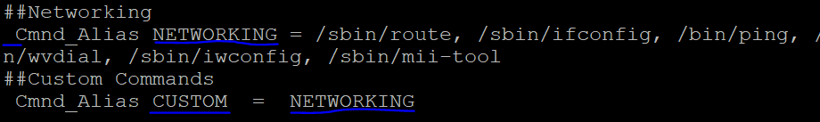
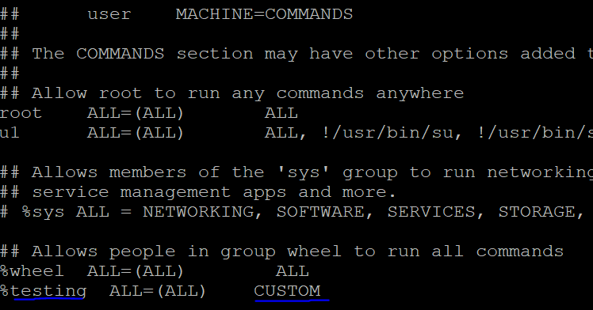
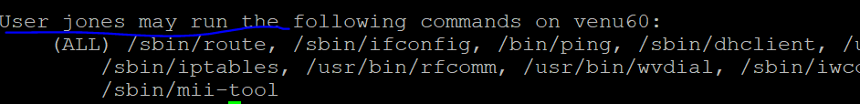

### SUDO (substitute user do)

* user add in sudo file `visudo`
  ```
    ##      user    MACHINE=COMMANDS
  ##
  ## The COMMANDS section may have other options added to it.
  ##
  ## Allow root to run any commands anywhere
  root    ALL=(ALL)       ALL
  u1      ALL=(ALL)       ALL
  ```
* when we login into normal user `u1` to run such commands like `fdisk -l,parted -l mount` ask one time password

* user can run without `sudo` command like
  ```
  [u1@venu60 /]$ fdisk -l
   fdisk: cannot open /dev/sda: Permission denied
   fdisk: cannot open /dev/sdb: Permission denied
   fdisk: cannot open /dev/sr0: Permission denied
   fdisk: cannot open /dev/mapper/testvg-test1lv: Permission denied
   [u1@venu60 /]$ parted -l
   /dev/mapper/control: open failed: Permission denied
   Failure to communicate with kernel device-mapper driver.
   Incompatible libdevmapper 1.02.181-RHEL8 (2021-10-20) and kernel driver (unknown version)
  ```
* user can run with `sudo` command and one time password for the user
  ```
  [u1@venu60 /]$ sudo fdisk -l
   [sudo] password for u1:
   Disk /dev/sda: 40 GiB, 42949672960 bytes, 83886080 sectors
   Units: sectors of 1 * 512 = 512 bytes
   Sector size (logical/physical): 512 bytes / 512 bytes
   I/O size (minimum/optimal): 512 bytes / 512 bytes
   Disklabel type: dos
   Disk identifier: 0x515ca363
   
   Device     Boot    Start      End  Sectors  Size Id Type
   /dev/sda1  *        2048  2099199  2097152    1G 83 Linux
   /dev/sda2        2099200 44042239 41943040   20G 83 Linux
   /dev/sda3       44042240 52430847  8388608    4G 82 Linux swap / Solaris
   /dev/sda4       52430848 83886079 31455232   15G  5 Extended
   /dev/sda5       52432896 53481471  1048576  512M 83 Linux
   /dev/sda6       53483520 55580671  2097152    1G 82 Linux swap / Solaris
   /dev/sda7       55582720 56631295  1048576  512M 8e Linux LVM
  ``` 
* default logs can check 
  ```
  cat /var/log/secure
  ```  
* separte log file in `visudo`
  
* when user run can do such activities to generate log files
  ```
  cat /var/log/sudo,log
  ``` 
  

* what is `wheel group`

  ```
  wheel group starts with %
  wheel group as a admin group
  wheel group as a make people for administrator

  ## Allows people in group wheel to run all commands
     %wheel  ALL=(ALL)        ALL
     %testing  ALL=(ALL)      ALL  
  ```
*   if a user to run restricted commands
  ```
  ## Allows people in group wheel to run all commands
    %wheel  ALL=(ALL)        ALL
    %testing  ALL=(ALL)      /usr/sbin/fdisk, /usr/sbin/parted
  ```
  

  * as normal user can run all commands 
  

*  normal user `u1` as a sudo permission convert to another user
* while converte another user that user password you know to login

  ```
  su u2 
  passwd for u2
  ``` 
  

* to block the u1 user in sudo permission in sudo file
  ```
  ./usr/bin/su
  ./usr/bin/sudo
  ```
  

* multiple user's in group or  specific user's to run only restricted commands for  `Cmnd_Alias` names
  

* those user's are in group or single user can run specific commands like `NETWORKING,STORAGE...`
* user can check which command are available to run after login
  ```
  sudo -l
  ```
  
    

*  
  
  

  
    