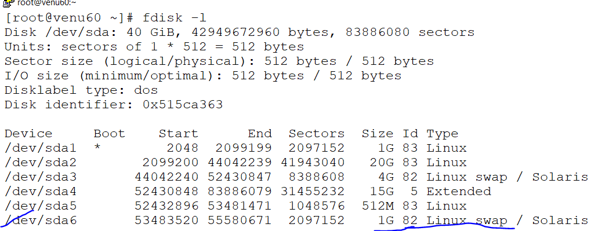
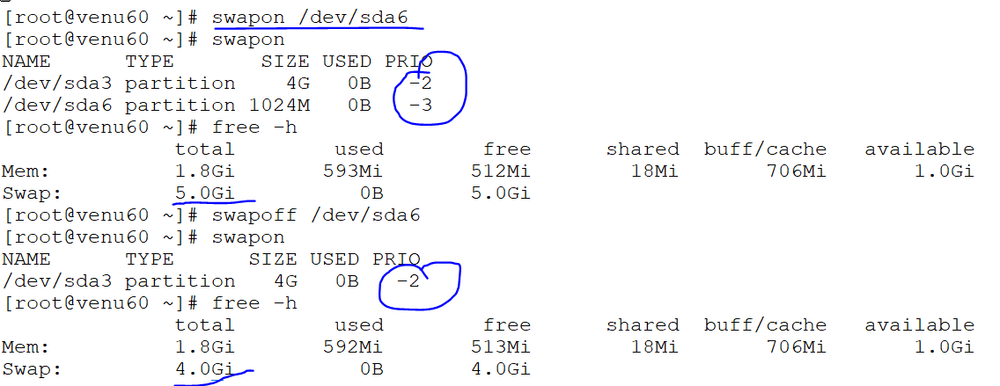
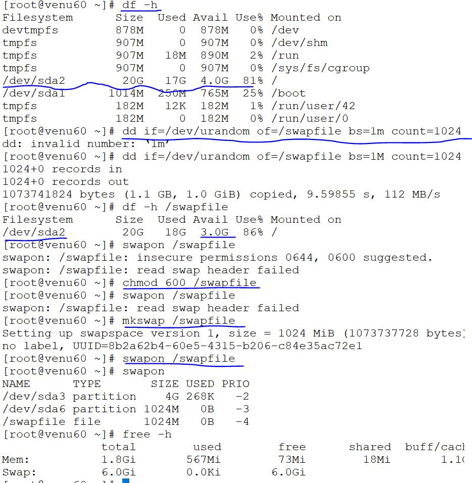

## SWAP MANAGEMENT SPACE

* minimum  `RAM` size to create a swap in system `4 Gb`

* ```
  swapon (activate the partition)
  swapoff(de-activate partition) 
  mkswap (format)
  swap (file-system)
  free -h (checking sizes)
  82 (code-swap) 
  ```

* create a swap partition minimum `1GB`

   ```
   fdisk /dev/sda
     .n
     .t
     .l
     .82
     .w
   ```
  
   
* make a file system for partition 
  
* check the sizes of partition `swapon & swapoff` by using `free -h`
  

* permanent mount `vim /etc/fstab`
         
* testing the fstab `mount -a`

* removing the swap partition `parted /dev/sda rm 6`

### create a swapfile

*  df -h /swapfile

* ```
  dd if=/dev/urandom of=/swapfile bs=1m count=1024
  
  dd-->dumped data
  if-->input for/dev/urandom
  of-->output for /dev/urandom
  bs-->block per secound
  count-->1024 (size of Gb)
  ```
  

  ```
  chmod 600 /swapfile
  mkswapfile /swapfile
  swapon /swapfile
  df -h /swapfile
  ```
  


