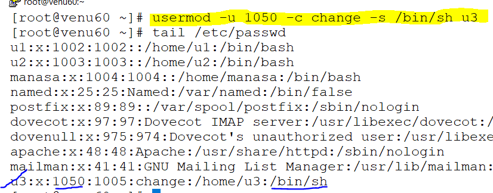
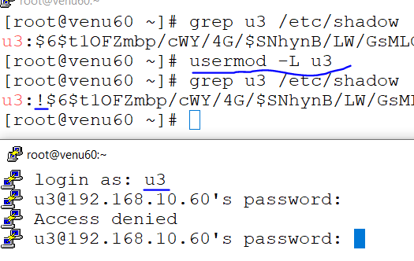
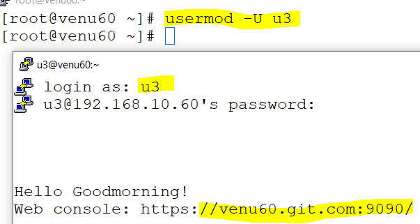
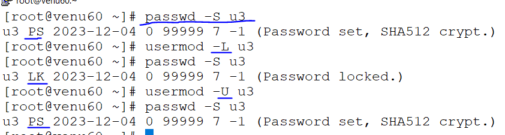
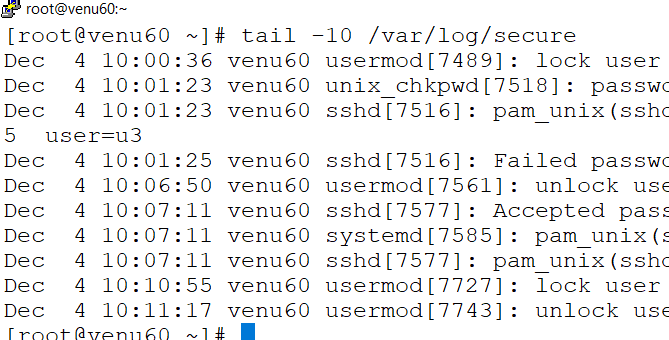
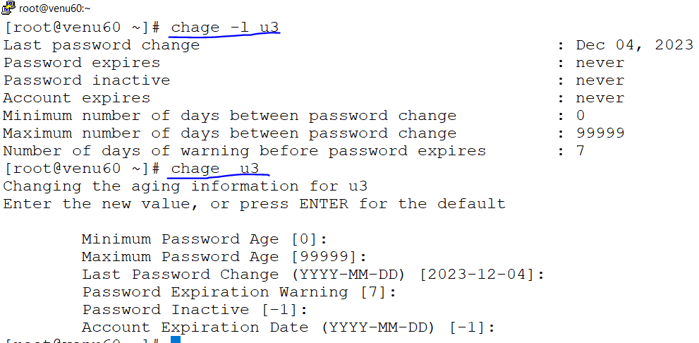

### USER MANAGEMENT
* add and set the password for the user
*  ```
   useradd u3
   passwd u3
   u3:x:1005:1005::/home/u3:/bin/bash
   ```
* every user as a unique id generate
* change the unique id for a user and change  the shell for user
  

* to convert one user to another user
  ```
  su u2
  passwd (as a user password)
  ```
* normal user conver to root user
  ```
  su -
  passwd (as root password)
  ```  
* root user can lock the normall user (u3)
  ```
  usermod --help
  usermod -L u3
  ```  
  

* root user can lock the normall user (u3) 
  

* how to check user's lock or unlock
  ```
  passwd -S u3
  ```  
      

* check the logs
  

* disable the login user `/sbin/nologin`  
  ```
  .S (checking the passwd login for user)
  .s (checking the nologin for user)
  .usermod -s /sbin/nologin (nologin)
  .usermod -s /bin/bash (login)
  ```
* check the user last login password details  
  ```
  chage --help
  chage -l u3 (user-name)
  chage u3
  ```
 

*  when user's are login immediatly display the message 
  ```
  vim /etc/motd
  motd-->message of the day
  ```
 * to delete the user
   ```
   userdel (user-name)
   in home directort
   cd /var/spool/mail
   ls
   userdel -r (user-name)
   ```
   
*     