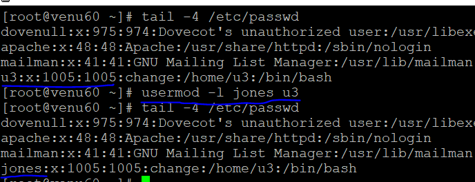

### USER MANAGEMENT
* add and set the password for the user
*  ```
   useradd u3
   passwd u3
   u3:x:1005:1005::/home/u3:/bin/bash
   ```
* every user as a unique id generates
* change the unique id for a user and change  the shell for user
  

* to convert one user to another user
  ```
  su u2
  passwd (another user password)
  ```
* normal user convert to root user
  ```
  su -
  passwd (as root password)
  ```  
* root user can lock and unlock the normal user (u3)
  ```
  usermod --help
  usermod -L u3
  usermod -u u3
  passwd -S u3
  ```  
  

  

* how to check user's lock or unlock
  ```
  passwd -S u3
  ```  
      

* check the logs
  ```
  cat /var/log/secure
  ```
  

* disable the login user `/sbin/nologin`  
  ```
  .S (checking the passwd login for user)
  .s (checking the nologin for user)
  .usermod -S /sbin/nologin (nologin)
  .usermod -s /bin/bash (login)
  ```
* checking user login password details  
  ```
  chage --help
  chage -l u3 (user-name)
  chage u3
  ```
 
 
 * rename the user
  ```
  usermod -l <new_name> <old_name>
  ``` 
  
  
*  when user's login immediately display the popup message 
  ```
  vim /etc/motd
  motd-->message of the day
  ```
 * delete the user
   ```
   userdel (user-name)
   in home directort
   cd /var/spool/mail
   ls
   userdel -r (user-name)
   ```
   
*     