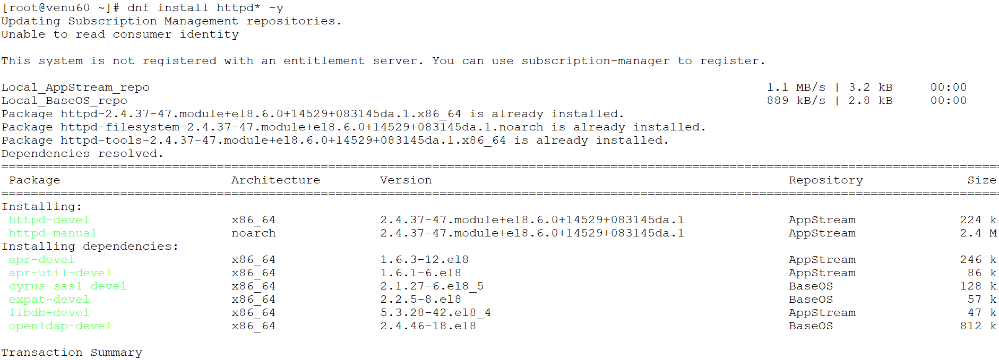
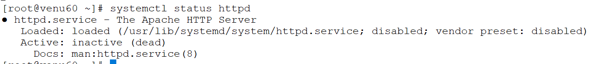
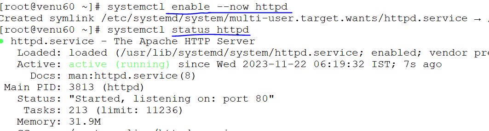
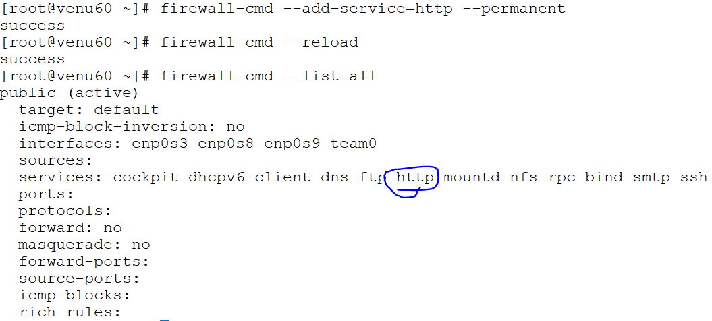
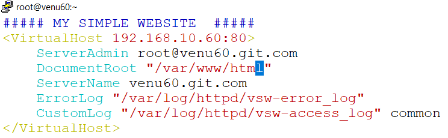
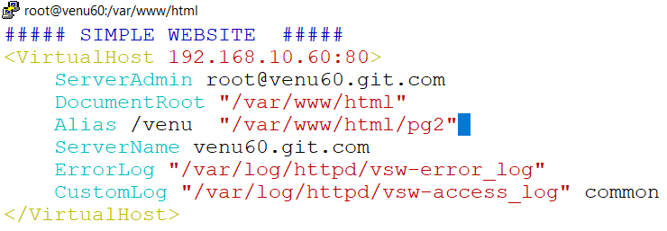
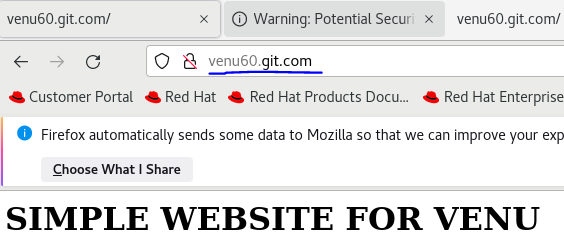
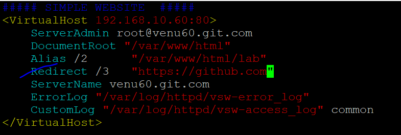

## WEB SERVER

* package : httpd
* port : 80,443
* sample configuration file : /usr/share/doc/httpd/httpd-vhost.conf
* configuration file : /etc/httpd/conf/httpd.conf
                     : /etc/httpd/conf.d/ssl.conf
* configuration directory : /etc/httpd/conf.d
* document root : /var/www/html
* daemon : htttpd
### lab-setup

* ```
  dnf install httpd* -y  
  ``` 
  

* ```
  systemctl status httpd
  systemctl enable --now httpd
  systemctl reload httpd 
  firewall-cmd --list-all
  firewall-cmd --add-service=httpd --permanent
  firewall-cmd --list-reload
  firewall-cmd --list-all
  ```
  
  
  

* create a own website 
  
  ```
  . cd /var/www/html
  . vim index.html
  ```

* create a web page in index.html and also altimalate configure in main file

  

* copying the sample configuration file into main configuration file directory called as 'vsw.conf'

  ```
  .  cp /usr/share/doc/httpd/httpd-vhosts.conf /etc/httpd/conf.d/vsw.conf
  ```

* vim /etc/httpd/conf.d/vsw.conf   
  

* create a new web pages with `Alias-names`
* create a directory name called as pg2 in /var/www/html in

  ```
  .cd /var/www/html
  .index.html pg2
  .cd pg2
  .vim index.html
  ```
  

  ```
  vim /etc/httpd/conf.d/vsw.conf
  ```
    
  
* and also open website with index.html `redirect` http://www.xxxx.com

  

* Only working rhel terminal in firefox brower  

  ```
  cd /var/wwww/html
   index.html
  ```


  
