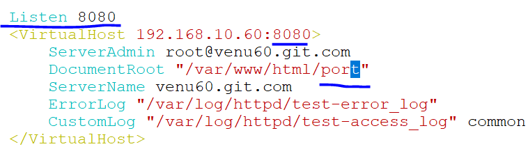

## WEB SERVER

*  package : httpd
*  port : 80,443
*  sample configuration file : /usr/share/doc/httpd/httpd-vhost.conf
*  configuration file : /etc/httpd/conf/httpd.conf
                     : /etc/httpd/conf.d/ssl.conf
*  configuration directory : /etc/httpd/conf.d
*  document root : /var/www/html
*  daemon : htttpd
### lab-setup

* ```
  dnf install httpd* -y  
  ``` 
  

* ```
  systemctl status httpd
  systemctl enable --now httpd
  systemctl reload httpd 
  firewall-cmd --list-all
  firewall-cmd --add-service=httpd --permanent
  firewall-cmd --list-reload
  firewall-cmd --list-all
  ```   
  
  
  
* after add firewall and enable the service,can check on any brower
  
  http://192.168.10.60
    
* create a own website 
  
  ```
  . cd /var/www/html
  . vim index.html
  ```

* create a web page in index.html and also altimalately configure in main file

  

* copying the sample configuration file into main configuration file directory called as 'vsw.conf'

  ```
  .  cp /usr/share/doc/httpd/httpd-vhosts.conf /etc/httpd/conf.d/vsw.conf
  ```

* vim /etc/httpd/conf.d/vsw.conf   
  

* create a new web pages with `Alias-names`
* create a directory name called as pg2 in /var/www/html in

  ```
  .cd /var/www/html
  .index.html pg2
  .cd pg2
  .vim index.html
  ```
  

  ```
  vim /etc/httpd/conf.d/vsw.conf
  ```
    
  
* and also open website with index.html `redirect` http://www.gmail.com

  
   
   ```
    <VirtualHost 192.168.10.60:80>
    ServerAdmin root@venu60.git.com
    DocumentRoot "/var/www/html"
    Alias /venu  "/var/www/html/web"
    Redirect /red "https://www.github.com"
    ServerName venu60.git.com
    ErrorLog "/var/log/httpd/vnu-error_log"
    CustomLog "/var/log/httpd/vnu-access_log" common
     </VirtualHost>
   ```
* Redirect means we can add any webste with own Alias names
  
* Only working rhel terminal in firefox brower  
  
  ```
  cd /var/wwww/html
   index.html
  ```
#### PORT BASED WEB-HOSTING

* ```
  cd /var/www
  ls
  html
  ```
* create a directory with name as `port`
  ```
  mkdir port
  cp html/index.html/port
  cd port
  vim index.html
    <h1>Port based network </h1>
  ```  
* create a new separate configuration file 
  
  ```
  cp /etc/httpd/conf.d/wed.conf /etc/httpd/conf.d/app.conf
  cd /etc/httpd/conf.d/
  ls
  cp web.conf app.conf
  ```  
  `192.168.10.60:8080` 
  
  ```
  Listen 8080
  <VirtualHost 192.168.10.60:8080>
    ServerAdmin root@venu60.git.com
    DocumentRoot "/var/www/port"
    ServerName venu60.git.com
    ErrorLog "/var/log/httpd/web-error_log"
    CustomLog "/var/log/httpd/web-access_log" common
   </VirtualHost>
  ```
  
  ```
  firewall-cmd --add-port=8080 --permanent
  firewall-cmd --reload
  firewall-cmd --list-all
  systemctl reload httpd.service
  ```

  
* check which port number are specified 
  
  ```
  netstat -ntlp |grep -i httpd
  ```

#### Named-based hosting 
* need lap-setup for dns configuration
 
 
 ```
 cd /var/named
 vim flz

 $TTL 1D
@       IN SOA venu60.git.com.  root.git.com. (
                                        12122024; serial
                                        1D      ; refresh
                                        1H      ; retry
                                        1W      ; expire
                                        3H )    ; minimum
        NS      venu60.git.com.

venu60  A   192.168.10.60
gitweb  CNAME  venu60

 ``` 

  
* systemctl reload named.service
* nslookup gitweb 
 
 ```
 /etc/httpd/conf.d/test2
 ```
 
* systemctl reload named.service

#### OPEN-SSL
* dnf install mod_ssl -y

 ```
 .openssl req-x509 -nodes -days 365 -newkey rsa:2048 -keyout server.key -out server.crt
  
 .ls /etc/pki/tls/
  cert.pem  certs  ct_log_list.cnf  misc  openssl.cnf  private

 .ls /etc/pki/tls/certs
  ca-bundle.crt  ca-bundle.trust.crt  localhost.crt  server.crt  server.key
  
 .cp server.crt /etc/pki/tls/certs
 .cp server.key /etc/pki/tls/private

 ```
* reload the service and https into firewall 
 ```
 systemctl reload httpd
 firewall-cmd --add-service=https --permanent
 firewall-cmd --reload
 ```
 
 
 


  
